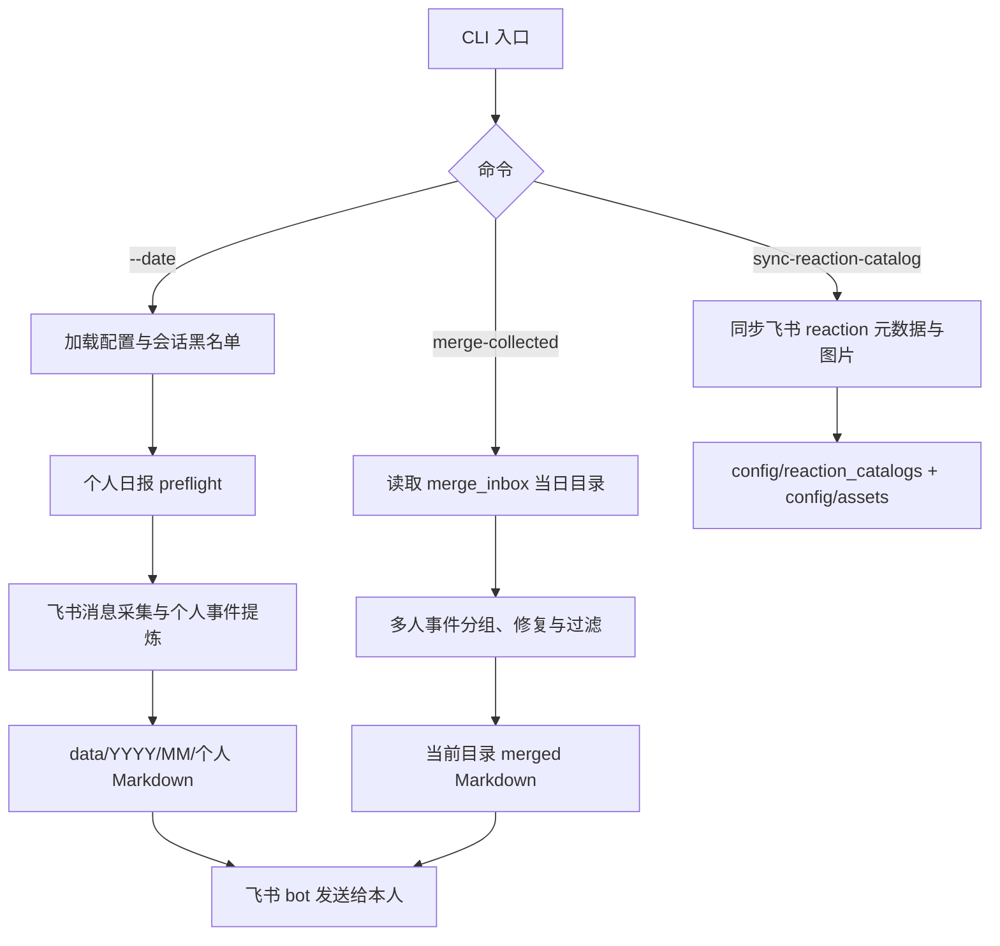
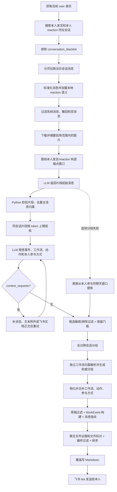
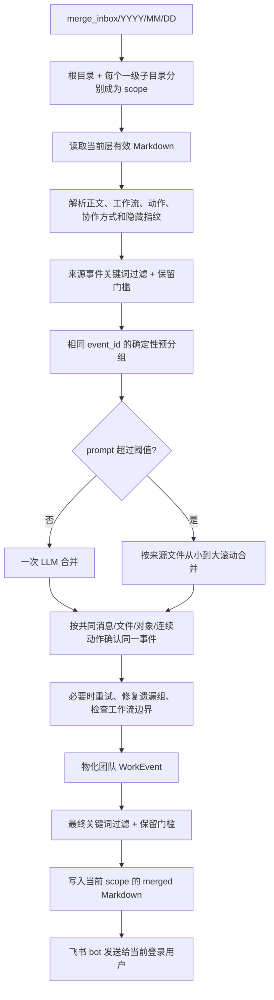

# WorkTrace

WorkTrace 是一个个人工作事件整理工具。它从当前用户在指定日期内直接参与的飞书沟通中提炼工作事件，生成可审阅的 Markdown，并先发送给当前用户自己。

仓库同时提供两条正式业务链路：

- 个人日报：读取当前用户可见的飞书消息，生成 `data/YYYY/MM/YYYY-MM-DD-姓名.md`
- 多人汇总：读取已收集的个人 Markdown，生成 `merge_inbox/YYYY/MM/DD/.../YYYY-MM-DD-登录人姓名-merged.md`

它不是员工监控系统，也不会默认把结果发给领导。个人日报会把必要的文本上下文和启用的图片内容发送给用户自己配置的在线模型服务，使用前必须确认模型服务和隐私边界。

## 快速使用说明

对 Agent 说：

- `帮我生成 2026-07-06 的个人事件MD`
- `帮我合并 2026-07-06 的部门事件MD`

或直接执行：

```bash
python3 -m src.worktrace.cli --preflight
python3 -m src.worktrace.cli --date 2026-07-06
python3 -m src.worktrace.cli merge-collected --date 2026-07-06
```

日常运行只读取本地表情目录。如需显式更新飞书表情目录：

```bash
python3 -m src.worktrace.cli sync-reaction-catalog --source feishu
```

三个入口都会向 `stdout` 输出 machine-readable JSON。个人日报正式执行前会自动运行 preflight；`merge-collected` 和 `sync-reaction-catalog` 是独立子命令，不走个人日报的整套 preflight。

## 当前范围

已经进入正式代码路径的能力：

- 使用 `lark-cli` user 身份发现会话和读取消息
- 同时把“本人发言”和“本人当天 reaction”作为会话发现及锚点信号
- 从本地表情目录补充 reaction 的中文名称、说明和语义
- 围绕本人锚点构造窗口，由 LLM 切分工作片段
- 将同一会话的多个片段按模型输入上限打包分析
- 按 `context_requests` 补更早/更晚消息、文本附件正文或飞书文档正文
- 主动下载并摘要启用范围内的图片附件
- 分段失败时改为直接从本人参与的聊天窗口提炼，不让单个窗口中断整天
- 对候选、合并草稿和最终事件执行多层 Python 校验与过滤
- 全日跨会话初始分组，并通过独立工作流 assignment 生成权威分组
- 聚合有证据支持的文件链接和附件名
- 覆盖写入个人 Markdown，并通过飞书 bot 发给当前用户自己
- 对已收集的多人 Markdown 做同日团队汇总，支持日期目录和一级子目录分别汇总

当前不做：

- 定时调度
- 跨天事件合并
- 从员工原始聊天自动生成领导汇总
- 自动上传到公司统一数据库
- 其他 IM 的正式接入

## 整体流程



## 个人日报流程

当前默认 analyzer 是 `OnlineLLMAnalyzer`。它支持分段批处理，因此正式主链不是旧文档中的“一个会话一次首轮 LLM”，而是下面的流程。



### 1. 会话发现与消息采集

`FeishuCliChatSource` 先查当前用户身份，再用两类信号发现目标会话：

- 当前用户在目标日期发送过消息
- 当前用户在目标日期对消息做过 reaction

`config/conversation_blacklist.json` 中的会话会在发现和拉取阶段同时排除。随后按会话分页拉取目标日期内消息并标准化文本、reply/quote、链接、附件和 reaction。

### 2. 锚点、分段与分段批处理

Python 围绕本人消息和 reaction 形成 `AnchorUnit`，当前主链窗口为前后各 30 条消息。每个锚点窗口先交给 analyzer 返回 `segment_start_message_ids`，Python 再把起点扩展成连续 `ConversationSegmentUnit`。

同一会话的片段会按 `max_model_input_tokens` 打包为 `SegmentAnalysisBatch`。模型为每个 `segment_id` 返回候选事件和上下文请求。候选除标题、内容和来源外，还可返回 `workstream_key`、`action_label` 和带证据消息的 `self_relations`。Python 校验参与类型是否来自 `config/event_metadata.json`，并确认每条参与证据确实是当前片段中的本人消息；无效参与项会丢弃并告警，新分段链中没有任何有效本人参与方式的候选不会进入后续合并。

若分段反复失败，系统会暂停对当前会话继续分段，改为直接从本人参与的聊天窗口提炼。`ConversationSlice` 仍存在，但主要作为片段兼容载体和补充上下文输入，不再代表“整个会话只调用一次模型”。

### 3. 上下文与附件

模型可请求：

- `earlier_messages`
- `later_messages`
- `attachment_text`
- `linked_file_text`

文本附件只在明确请求时下载和读取，范围由 `config/attachment_text.json` 控制。飞书 Docx/Wiki 正文也只在明确请求时读取。

图片是当前主链的主动能力：`config/image_summary.json` 启用后，系统在分段前下载符合限制的图片，通过当前在线模型生成低分辨率工作内容摘要，再把摘要附到对应片段。图片下载失败或摘要失败会记 warning 并跳过，不中断整天。

### 4. 候选过滤、跨会话合并与工作流校正

每个候选必须携带真实来源消息 ID、本人关联证据、具体对象、保留理由和保留依据。Python 会先执行配置关键词过滤和结构化保留门槛。

候选多于一条时，LLM 先返回跨会话语义分组，Python 校验/修复覆盖关系。当前 Online analyzer 还支持结构化 `request_json`，runner 随后会对全部候选执行独立的工作流归属请求，并以 `WorkstreamAssignment` 生成权威分组；未分配候选会在已有工作流上下文中再判断一次。工作流根名称会写入最终分组；只有工作流请求失败时，才回退到候选 `workstream_key`。物化 `MergedEventDraft` 时，主要动作按来源消息顺序去重，参与方式按配置顺序去重。

合并草稿和最终 `WorkEvent` 还会再次执行关键词过滤与保留门槛，因此模型输出不能绕过 Python 规则。

### 5. 文件、输出与发送

最终事件只聚合有来源证据支持的文档链接和附件。可点击链接会隐藏敏感 query 参数；普通附件以 `《文件名》` 展示。

个人输出路径：

```text
data/YYYY/MM/YYYY-MM-DD-姓名.md
```

同日重跑采用覆盖写入。即使当天没有保留事件，也会生成一份 `event_count: 0` 的合法 Markdown。写入完成后，系统通过 `lark-cli im +messages-send --as bot` 把文件发给当前用户自己；发送失败会保留本地文件并在 JSON 摘要中返回 warning。

## 多人汇总流程

多人汇总只读取已经生成的 WorkTrace Markdown，不重新读取员工聊天。



输入示例：

```text
merge_inbox/2026/07/06/
├── 2026-07-06-张三.md
├── 李四-2026-07-06.md
└── 项目A/
    └── 2026-07-06-王五.md
```

根目录和 `项目A/` 会分别生成一个 `YYYY-MM-DD-登录人姓名-merged.md`。只扫描当前层，二级及更深目录不参与。

新个人日报、旧个人日报和上游 `*-merged.md` 可以混合输入。若旧文件仅在尾部留下一个未闭合事件，系统保留此前完整事件、跳过残缺事件并记录 `partial_file_count` 和具体 warning；没有任何完整事件或 front matter 无效时仍整份跳过，且不会修改来源文件。

两条事件都有非空工作流且名称不同，Python 会禁止合并；工作流相同也不能单独作为合并理由。共同消息指纹、共同文件、相同具体对象或连续动作只是强证据，仍由模型结合内容确认。只有标题相似、时间接近或部门相同不会触发合并。

同一事件的不同员工描述会作为不同视角整合，最终不按人员逐条展示贡献。来源文件名中的姓名与当前登录用户名精确一致时，该来源会标记为“合并人来源”；只有来源间出现明确冲突时才采用合并人版本并写 warning，没有冲突时任何一方提供的有效补充都必须保留。

## 输出字段

个人 Markdown 事件公开字段：

- 日期
- 事件标题
- 工作流
- 主要动作
- 内容
- 具体对象
- 本人参与方式
- 保留理由
- 保留依据
- 涉及文件

团队汇总把“本人参与方式”改为“协作方式”，并额外显示：

- 来源人员
- 来源事件 ID

`event_id`、内部 `retention_reason` 枚举和 `merge_meta` 保存在 HTML 注释中。`merge_meta` 只保存消息证据和稳定文件标识的 SHA-256 结果，不保存原始 `om_`、`oc_`、`ou_` 标识。旧 Markdown 没有新字段时仍可读取和参与汇总，新字段显示“未明确”。

允许的保留理由枚举：

- `deliverable_updated`
- `decision_made`
- `issue_or_risk_found`
- `follow_up_assigned`
- `external_business_progress`
- `substantive_approval`

## 配置

### 本地私有模型配置

复制模板并填写本地私有值：

```bash
cp .env.example .env
```

必填：

```dotenv
WORKTRACE_LLM_BASE_URL=https://your-openai-compatible-endpoint.example/v1
WORKTRACE_LLM_MODEL=your-model-name
WORKTRACE_LLM_API_KEY=your-api-key
WORKTRACE_LLM_REASONING_EFFORT=none
```

可选：

```dotenv
WORKTRACE_LLM_TIMEOUT_SECONDS=600
WORKTRACE_LLM_STREAM=false
WORKTRACE_LLM_TLS_VERIFY=false
WORKTRACE_LLM_SLEEP_MIN_SECONDS=1
WORKTRACE_LLM_SLEEP_MAX_SECONDS=2
WORKTRACE_COLLECTED_MERGE_TRACE=false
WORKTRACE_COLLECTED_MERGE_TRACE_ROOT=data/debug/collected_merge
WORKTRACE_COLLECTED_MERGE_MISSING_FIELD_RETRY_RATIO=0.2
WORKTRACE_COLLECTED_MERGE_MISSING_FIELD_RETRY_LIMIT=1
WORKTRACE_COLLECTED_MERGE_RETRYABLE_ERROR_LIMIT=1
WORKTRACE_COLLECTED_MERGE_RETRY_DELAY_SECONDS=2
```

环境变量优先于 `.env`。真实密钥不能和代码一起提交到 git。正式请求统一追加 `/no_think`，主流程要求 `WORKTRACE_LLM_REASONING_EFFORT=none`。

### 规则与能力配置

| 文件 | 当前作用 |
| --- | --- |
| `config/event_rules.json` | 敏感事件、普通事件排除和本人指派三类关键词 |
| `config/event_metadata.json` | 本人参与方式的英文键、中文显示名和排序 |
| `config/conversation_blacklist.json` | 在消息采集前排除整个会话 |
| `config/attachment_text.json` | 文本附件扩窗的开关、扩展名、数量和大小限制 |
| `config/image_summary.json` | 图片摘要开关、提示词、数量和大小限制 |
| `config/reaction_catalogs/*.json` | reaction 的名称、说明、语义和资源路径 |

可调整的敏感、普通排除和本人指派关键词，以及参与方式的显示文案和顺序，必须维护在配置文件中，不应继续写入 Python。结构化 schema、字段完整性、ID 归属、流程控制，以及当前已有的结构化保留门槛由代码负责。

`event_rules.json` 当前只支持三个顶层键，旧键会直接报错：

```json
{
  "sensitive_event_keywords": ["示例敏感词"],
  "excluded_event_keywords": ["示例噪音词"],
  "self_assignment_keywords": ["示例指派词"]
}
```

敏感词和排除词都采用归一化后的包含匹配，并在候选、合并草稿和最终事件阶段重复执行；最终事件还会检查文件标题和 URL。指派词只作为“同一语句明确点名本人”的兜底，本人发言、reply/quote 和 reaction 证据不依赖该列表。

## 运行前检查

```bash
python3 -m src.worktrace.cli --preflight
```

当前检查包括：

- Python 3.11+
- `lark-cli` 可执行且当前身份是 user
- 在线模型必填配置
- `WORKTRACE_LLM_REASONING_EFFORT=none`
- Responses API 结构化探针
- `data/` 可写
- `Asia/Shanghai` 时区可用

探针接受纯 JSON，也接受模型用 Markdown 代码块包裹的合法 JSON。

## 调试与排障

个人日报调试：

```bash
python3 -m src.worktrace.cli --date 2026-07-06 --debug-output
```

调试产物位于 `data/debug/conversations/<target_date>/`，可能包含：

- 锚点分段输入、prompt、原始输出和校验结果；失败轮次保存 `failure.json`
- 分段批次输入、prompt、原始输出和统计；失败轮次保存 `failure.json`
- 批次失败后的单片段回退保存在各片段的 `fallback-01/`
- 上下文补充前后的片段
- 分段失败后的直接提炼结果保存在 `_anchor_fallback/`
- `_merge_day_candidates/` 下的全日合并输入输出
- 工作流归属补充判断和最终分组
- `final_events.json`：最终合并草稿、完成文件聚合和排序后的事件，以及最终过滤 warning

多人汇总跟踪通过 `.env` 的 `WORKTRACE_COLLECTED_MERGE_TRACE=true` 开启，默认写入 `data/debug/collected_merge/<target_date>/`。`source-audit.json` 记录每个来源文件的格式、声明/解析/过滤数量和部分读取状态；每次真实模型调用会在请求前写入 `step-NNN.json` 与 `step-NNN-prompt.txt`，保存完整 `input_events` 和 `deterministic_groups`，成功和失败都会更新状态。`summary.json`、`summary.md` 在模型失败时也会生成，并记录失败步骤、重试、具体过滤事件、最终事件和 `boundary_warnings`。

429、HTTP 5xx、连接失败、超时、流式 JSON 异常及空或无效 JSON 返回会按配置只重试当前滚动批次。401、403、TLS 证书和请求参数错误不会重试。过滤诊断只记录阶段、类别、来源文件、来源人员、事件 ID 和标题，不记录命中关键词或完整敏感正文。

调试文件可能包含裁剪后的聊天、附件正文、图片摘要和模型输出，只应临时启用，不应提交或长期保留。

## 安装

macOS/Linux：

```bash
bash ./scripts/install_worktrace.sh
```

Windows PowerShell：

```powershell
powershell -ExecutionPolicy Bypass -File .\scripts\install_worktrace.ps1
```

手动安装依赖：

```bash
python3 -m pip install -r requirements.txt
```

仓库根目录就是 Codex skill 根目录，安装 skill 时链接整个仓库，而不是单独链接子目录。

## 文档索引

- [详细设计](docs/detailed-design.md)：当前代码的权威流程、数据边界和模块职责
- [当前实现拆解](docs/implementation-breakdown.md)：按文件查找实现入口
- [员工使用说明](docs/employee-guide.md)：安装、运行和常见问题
- [隐私说明](docs/privacy-note.md)：员工可直接阅读的短版隐私边界
- [分段与扩窗设计](docs/conversation-slice-retry-design.md)：主链分段批处理、上下文重试和分段失败后直接提炼
- [跨会话合并设计](docs/cross-conversation-merge-design.md)：全日候选分组和工作流归属校正
- [多人汇总设计](docs/collected-people-merge-plan.md)：`merge-collected` 当前实现
- [Online Analyzer](docs/online-analyzer-usage.md)：Responses API 调用和错误边界
- [Markdown 输出](docs/markdown-output-simplification-design.md)：事件文件格式
- [锚点实验使用说明](docs/anchor-experiment-usage.md)：独立实验入口，不等同于正式日报
- [锚点能力当前状态](docs/anchor-first-implementation-breakdown.md)：正式主链与独立实验的边界
- [锚点协议](docs/anchor-analysis-protocol.md)：分段失败后直接提炼和独立实验使用的协议
- [锚点设计演进记录](docs/anchor-first-multi-pass-design.md)：历史设计与当前落地对照

## 开发验证

```bash
python3 -m pytest
git diff --check
```

文档行为变化应同步更新 README、`docs/detailed-design.md`、相关专题文档和 `tests/unit/test_docs_contract.py`。
