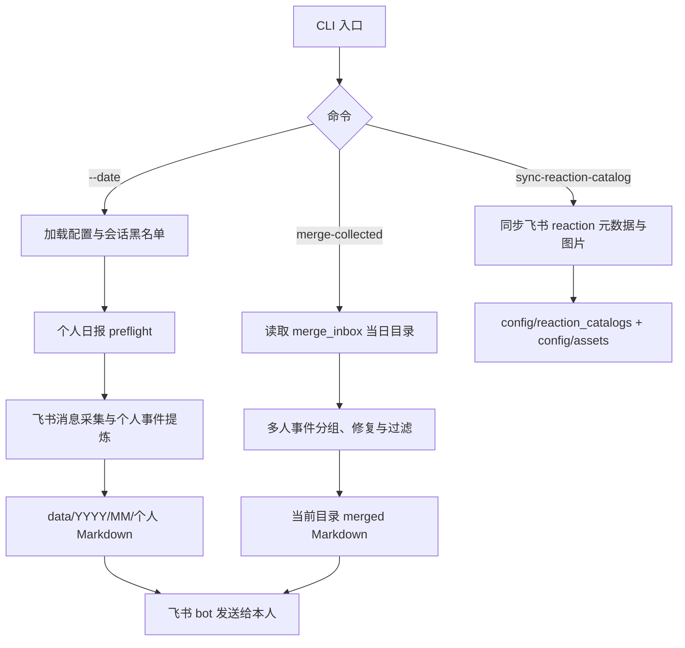
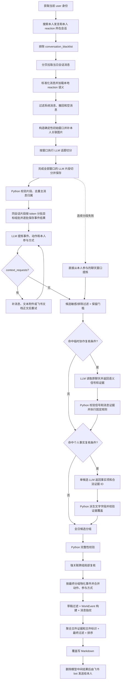
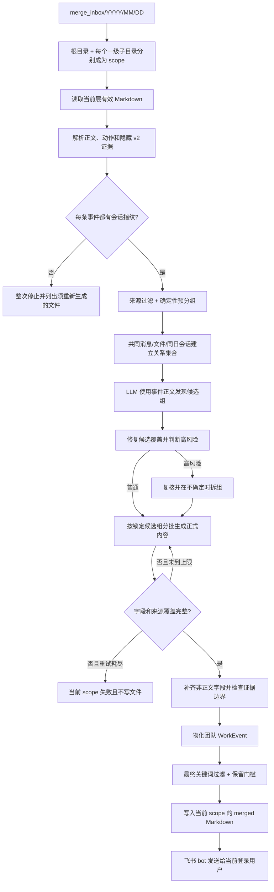

# WorkTrace

WorkTrace 是一个个人工作事件整理工具。它从当前用户在指定日期内直接参与的飞书沟通中提炼工作事件，生成可审阅的 Markdown，并先发送给当前用户自己。

仓库同时提供两条正式业务链路：

- 个人日报：读取当前用户可见的飞书消息，生成 `data/YYYY/MM/YYYY-MM-DD-姓名.md`
- 多人汇总：读取已收集的个人或上游汇总 Markdown，生成 `merge_inbox/YYYY/MM/DD/.../YYYY-MM-DD-登录人姓名-merged.md`

它不是员工监控系统，也不会默认把结果发给领导。个人日报会把必要的裁剪文本、会话名、发送者信息、消息和会话标识、链接 URL/标题、附件文件名，以及启用的图片或按需读取的附件/文档正文发送给用户自己配置的在线模型服务，使用前必须确认模型服务和隐私边界。最终 Markdown 会隐藏群名和内部标识，但这不表示模型输入不包含这些上下文元数据。

## 快速使用说明

对 Agent 说：

- `帮我生成 2026-07-06 的个人事件MD`
- `帮我合并 2026-07-06 的部门事件MD`

或直接执行：

```bash
python3 -m src.worktrace.cli --preflight
python3 -m src.worktrace.cli --date 2026-07-06
python3 -m src.worktrace.cli --date 2026-07-06 --resume
python3 -m src.worktrace.cli merge-collected --date 2026-07-06
```

日常运行只读取本地表情目录。如需显式更新飞书表情目录：

```bash
python3 -m src.worktrace.cli sync-reaction-catalog --source feishu
```

三个入口都会向 `stdout` 输出 machine-readable JSON。个人日报正式执行前会自动运行 preflight；`merge-collected` 和 `sync-reaction-catalog` 是独立子命令，不走个人日报的整套 preflight。

个人日报把未完成任务的模型中间结果临时保存在 `data/cache/llm/YYYY/MM/YYYY-MM-DD/`：先完成全部窗口切分，再逐批提炼事件。默认重新生成会在 preflight 通过后先删除旧个人日报、当天中间结果和当天个人调试目录，再从头执行；明确使用 `--resume` 时保留这三类旧产物，并只复用输入未变化的中间结果。Markdown 写入成功后，模型中间结果目录自动删除。

`config/llm_retry.json` 可分别设置 Online 请求级额外重试次数、窗口切分、事件提炼和全日分组的结果质量重试次数、流式响应首次返回时间、Codex 调用间隔，以及切分、提炼、个人事实复核、强关联局部复核和多人高风险复核并发数。`WORKTRACE_LLM_STREAM` 是文字和图片请求共用的唯一流式开关，默认关闭；显式开启时，从请求开始到首个流事件的限制为 60 秒，首个流事件返回后不再使用该限制，后续读取使用 `.env` 的 `WORKTRACE_LLM_TIMEOUT_SECONDS`。

## 当前范围

已经进入正式代码路径的能力：

- 使用 `lark-cli` user 身份发现会话和读取消息
- 同时把“本人发言”和“本人当天 reaction”作为会话发现及锚点信号
- 从本地表情目录补充 reaction 的中文名称、说明和语义
- 围绕本人锚点构造窗口，由 LLM 切分工作片段
- 将同一会话的多个片段按模型输入分批目标打包分析
- 按 `context_requests` 补更早/更晚消息、文本附件正文或飞书文档正文
- 主动下载并摘要本人发送或本人 reply/quote 直接关联的图片，其他图片按需处理
- 分段失败时改为直接从本人参与的聊天窗口提炼，不让单个窗口中断整天
- 对候选、合并草稿和最终事件执行多层 Python 校验与过滤
- 对边界 `follow_up_assigned` 候选局部复核原聊天，区分临时协作和实质工作
- 全日候选分组、Python 完整性校验和强关联漏合并复核
- 聚合有证据支持的文件链接和附件名
- 覆盖写入个人 Markdown，并通过飞书 bot 发给当前用户自己
- 对已收集的多人 Markdown 做同日团队汇总，支持日期目录和一级子目录分别汇总

当前不做：

- 定时调度
- 跨天事件合并
- 从员工原始聊天自动生成领导汇总
- 自动上传到公司统一数据库
- 其他 IM 的正式接入

## 整体流程



## 个人日报流程

当前默认 analyzer 是 `OnlineLLMAnalyzer`。它支持分段批处理，因此正式主链不是旧文档中的“一个会话一次首轮 LLM”，而是下面的流程。



### 1. 会话发现与消息采集

`FeishuCliChatSource` 先查当前用户身份，再用两类信号发现目标会话：

- 当前用户在目标日期发送过消息
- 当前用户在目标日期对消息做过 reaction

`config/conversation_blacklist.json` 中的会话会在发现和拉取阶段同时排除。随后按会话分页拉取目标日期内消息并标准化文本、reply/quote、链接、附件和 reaction。为补齐私聊 reply/quote 直接关系或模型明确请求的相邻上下文，系统还可能临时读取目标日期之外的直接关联消息；事件日期仍固定为目标日期。

### 2. 初始窗口、分段与分段批处理

Python 围绕本人消息和 reaction 形成 `AnchorUnit`。群聊会把相邻锚点按时间和无关插话数量聚合：当前配置为间隔不超过 10 分钟、两组锚点之间最多 3 条无关消息，并在窗口前补 2 条时间上下文；窗口还会补齐当天可见的 reply/quote 关系。私聊先按当天整段会话形成一个窗口，并补一层跨日 reply/quote 直接关系。以上阈值来自 `config/conversation_window.json`，不再固定读取每个锚点前后各 30 条消息。窗口组装后会按分段任务的完整 Function 定义和当前合法 ID 示例估算输入；超过 `model_input_batch_target_tokens` 时按锚点和消息时间线继续拆分，拆到最小窗口仍超过目标时标记后发送。

每个初始窗口先交给 analyzer 返回 `segment_start_message_ids`，Python 再把起点扩展成连续 `ConversationSegmentUnit`。模型需要更多时间上下文时，当前每个方向补 7 条、最多扩展 2 轮。

窗口切分和事件提炼分别在各自阶段内并发执行。待发请求按实际输入内容大小从大到小排序，较大的消息窗口、图片/文件摘要或片段批次优先调用模型；同一会话仍在上一个窗口完成后才发送下一个窗口。

同一会话的片段会按 `model_input_batch_target_tokens` 打包为 `SegmentAnalysisBatch`。该配置也是锚点降级、跨会话候选分组、多人合并候选发现、跨批汇合和正式内容生成的统一分批目标，当前默认 `5200`。固定结构的 Online 请求使用任务专用 Function Calling，Function 参数结构同时供 Codex `--output-schema` 使用。统一估算口径为：

```text
prepared_prompt = 最终提示词 + 当前合法参数示例 + 当前证据编号清单 + 当前重试错误反馈 + /no_think
online_estimate = estimate(prepared_prompt + tools 完整 Function 定义 + tool_choice)
codex_estimate = estimate(prepared_prompt + 完整 output-schema)
input_estimated_tokens = max(online_estimate, codex_estimate)
```

分批和最终请求检查调用同一个 Python 估算函数；动态枚举、Function 说明、`strict`、`tool_choice` 和关系编号都计入。组合输入超过目标时先在保留结构信息的上层继续拆分；单条事件片段、单个临时协作复核候选、单个事实复核候选或最小必要窗口本身仍超过目标时，标记为 `oversized_singleton` 后发送。局部重试加入具体错误后会重新估算；如果因此超过目标，为保证只重试当前请求，会标记为 `oversized_retry` 后发送。这里的 `5200` 是模型输入估算目标，不是 HTTP 字节数、服务端上下文上限或响应中的精确 `usage.input_tokens`；实际输入 token 只用于事后核对。模型为每个 `segment_id` 返回候选事件和上下文请求。候选除标题、内容和来源外，还可返回 `action_label` 和带证据消息的 `self_relations`。Python 校验参与类型是否来自 `config/event_metadata.json`，并确认每条参与证据确实是当前片段中的本人消息；无效参与项会丢弃并告警，新分段链中没有任何有效本人参与方式的候选不会进入后续分组。

若分段反复失败，系统会暂停对当前会话继续分段，改为直接从本人参与的聊天窗口提炼。`ConversationSlice` 仍存在，但主要作为片段兼容载体和补充上下文输入，不再代表“整个会话只调用一次模型”。

### 3. 上下文与附件

模型可请求：

- `earlier_messages`
- `later_messages`
- `attachment_text`
- `linked_file_text`

文本附件只在明确请求时下载和读取，范围由 `config/attachment_text.json` 控制。飞书 Docx/Wiki 正文也只在明确请求时读取。附件文件名属于消息元数据，会进入模型输入；当消息明确表示发送、查看、审核、转交或处理该附件时，事件可以引用附件 ID，但不能根据文件名推断附件正文事实。无效附件引用会被移除，不会单独导致整个候选事件被删除。

本人发送的图片，以及本人直接回复或引用目标消息中的图片，会在首次模型调用前下载并生成摘要；目标消息在当天窗口外时也会一并补入。其余图片仍只在模型明确请求 `attachment_text` 时下载。图片摘要同时提供给话题切分和事件提炼；同一图片在单次运行内复用摘要。`config/image_summary.json` 的数量上限只限制模型按需获取的图片，不限制上述本人关联图片。图片下载失败或摘要失败会记 warning 并跳过，不中断整天。

### 4. 候选过滤、全日分组与强关联复核

每个候选必须携带真实来源消息 ID、本人关联证据、具体对象、保留理由和保留依据。Python 会先对标题、正文、主要动作、具体对象和保留依据执行配置关键词过滤，再执行结构化保留门槛。

本人真实参与只证明事件与本人有关，不等于该内容值得进入日报。通过上述检查后，符合 `config/retention_policy.json` 条件的 `retention_reason=follow_up_assigned` 且没有链接和附件的候选进入局部复核。复核发生在全日分组前，因此仍可读取候选对应的原聊天。

局部模型只返回临时协作信号、实质工作信号及其真实消息 ID，不返回 `keep/drop`，也不计算数量。Python 不阅读聊天文字来判断语义，只检查候选是否完整返回、信号类型是否来自 `config/retention_policy.json`、证据消息是否属于当前候选，再执行固定规则：有任一合法实质工作信号就保留；没有实质信号但有临时协作信号就删除；两类合法信号都没有时按当前配置删除。临时与实质信号同时存在时仍然保留。

该设计不会增加“在干嘛”“到工位”“帮我看一眼”等全局排除词。模型结果缺失、重复、字段不完整或引用非法证据时，只重试当前复核批次，并把错误码、字段位置和相关 ID 反馈给模型；技术失败或重试后协议仍错误时，整次个人日报返回 `failed`，不会写入不完整文件。正常删除不产生 warning，只进入 Python 计算的 `retention_review_summary`。所有复核请求同样按任务专用 Function 和统一输入估算使用 `model_input_batch_target_tokens=5200` 分批；单个复核候选仍超过目标时允许发送，模型服务拒绝后直接失败，没有边界候选时不会增加模型调用。

首次个人事件提炼还必须返回 `fact_items`：标题、正文、主要动作、具体对象和保留依据中的每项事实，都要引用当前事件的真实来源消息 ID；模型同时可按 `config/retention_policy.json` 返回 `fact_risk_flags`。Python 只检查字段文字是否被 `fact_items` 完整覆盖、消息 ID 是否属于当前聊天，不判断“某个地点是不是对比案例”或“某个动作由谁完成”。

事实证据不完整、来源消息达到 8 条、来源参与人达到 3 人，或命中配置中的多个对象、对比案例、多个地点、责任归属、推断决策等风险信号时，系统在全日分组前增加一次个人事实局部复核。每个请求只复核一个候选；模型只返回 `supported`、固定结构的 `fact_items` 和 `removed_claims`，标题、正文、主要动作、具体对象和保留依据不在外层重复返回。Python 从 `fact_items` 派生最终文字字段。请求 Function 参数结构将 `draft_id` 限制为当前候选，并把每个 `evidence_message_id` 限制为当前候选的合法证据枚举，从生成阶段阻止引用其他消息。

复核模型重新读取原聊天，可以确认原文，也可以删除或改写无证据内容；复杂、多步骤事件本身不是删除理由。Python 校验唯一候选完整返回、每个事实只引用合法消息、正文与事实项完全一致，再按固定规则接收修订；原聊天无法同时支持标题、正文、具体对象和保留依据时返回 `supported=false` 并按配置删除。不同候选最多同时处理 3 条，同一候选内部的协议重试仍按顺序执行。协议错误只重试当前候选，重试反馈会明确列出缺失字段，重试失败仍然不写文件。

事实复核的选择数、确认数、修订数、无依据删除数、批次数和重试数由 Python 计算，写入 CLI stdout JSON 的 `personal_fact_review_summary`。Markdown 不显示消息 ID 或新增事实复核字段；旧个人 MD 和既有部门汇总不追溯修改。

旧个人 MD 和已经生成的部门汇总不追溯处理；重新生成个人日报后，新规则才会体现在新文件中。多人汇总仍只读取已生成的 Markdown，不回头读取员工原聊天做这项复核。

候选多于一条时，LLM 通过全日分组 Function 返回 `draft_ids`、`primary_draft_id`、`merge_reason` 和 `evidence_message_ids`，稳定 `group_id` 由 Python 生成。Python 检查候选无遗漏、无重复，主事件属于组内，证据属于组内来源；多事件组还必须有具体理由和合法证据，全部单例也是合法结果。完整输入超过 5200 时，Python 按候选顺序分批完成局部分组，再把每个局部组压缩成保留标题、对象和正文首尾的临时摘要，继续做跨批判断并映射回全部原始 draft ID。

Python 以同一来源片段、直接 reply/quote、共享来源消息和共享文件建立强关联；同一会话本身不触发复核。强关联跨越已有组时，最多三路并行请求模型判断完整现有组是否属于同一事项，不允许拆散已合法组。语义说明统一来自 `config/event_grouping.json`，Python 不读取聊天文字判断业务含义。全日结果非法时，Online 带具体错误重试一次，再把当前请求交给 Codex 一次；Codex 返回仍非法时保留完全合法组、其余候选拆成单例并写 warning，Codex 技术调用失败则终止生成。局部复核失败或持续非法时保留复核前分组并写 warning。

CLI JSON 和调试回放写入 Python 计算的 `day_grouping_summary`，包括候选数、初始/最终组数、复核组件和请求数、校验重试、Codex 备用、拆单修补候选数和 warning 数。旧 Markdown 和旧 trace 中的工作流字段仍可读取，但读取后丢弃；新 Markdown、缓存和 trace 不再生成该字段。物化 `MergedEventDraft` 时，主要动作按来源消息顺序去重，参与方式按配置顺序去重。

合并草稿和最终 `WorkEvent` 还会再次执行关键词过滤与保留门槛，因此模型输出不能绕过 Python 规则。

### 5. 文件、输出与发送

最终事件只聚合有来源证据支持的文档链接和附件。模型可显式引用来源消息中的附件；事件正文精确写出附件文件名且来源会话中存在该附件时，Python 也可补齐附件引用。可点击链接会隐藏敏感 query 参数；普通附件以 `《文件名》` 展示。

个人输出路径：

```text
data/YYYY/MM/YYYY-MM-DD-姓名.md
```

同日重跑采用覆盖写入。即使当天没有保留事件，也会生成一份 `event_count: 0` 的合法 Markdown。写入完成后，系统通过 `lark-cli im +messages-send --as bot` 把文件发给当前用户自己；发送失败会保留本地文件并在 JSON 摘要中返回 warning。

## 多人汇总流程

多人汇总只读取已经生成的 WorkTrace Markdown，不重新读取员工聊天。



输入示例：

```text
merge_inbox/2026/07/06/
├── 2026-07-06-张三.md
├── 李四-2026-07-06.md
└── 项目A/
    └── 2026-07-06-王五.md
```

根目录和 `项目A/` 会分别生成一个 `YYYY-MM-DD-登录人姓名-merged.md`。只扫描当前层，二级及更深目录不参与。

### 部门到中心的两级人工收集

当前代码不区分“部门汇总命令”和“中心汇总命令”，两级都运行同一个 `merge-collected`。输出名来自执行命令时当前飞书登录人的姓名，因此正确流程是：

1. 每位员工先生成带 v2 会话证据的个人 MD。
2. 每位部门负责人把本部门个人 MD 放入当日目录，使用自己的飞书身份运行一次，得到 `YYYY-MM-DD-部门负责人-merged.md`。
3. 中心负责人收集各部门的 `*-merged.md`；需要其他个人记录参与时，也可以同时放入个人 MD。
4. 中心负责人使用自己的飞书身份再次运行，得到 `YYYY-MM-DD-中心负责人-merged.md`。

文件组合由负责人人工控制。个人 MD 与已经包含该人员的部门 MD 同时存在时，程序会把两份都作为正常输入，不比较 `source_event_ids`，不拦截，也不写重复来源 warning。一级子目录是并列的独立汇总范围，不表示系统会自动按“员工 -> 部门 -> 中心”顺序连续执行。

多人汇总只接受带 v2 会话证据的新个人日报和新版上游 `*-merged.md`。任一事件缺少会话指纹时，所有 scope 都会在模型调用、文件写入和发送前停止，并列出必须重新生成的文件。若新版文件仅在尾部留下一个未闭合事件，系统仍按既有部分恢复规则处理，并记录 `partial_file_count`。

历史 v1 文件仍可用于检查解析数量、输入规模和旧输出质量，但缺少同日会话证据，不能直接运行当前多人汇总，也不能用来证明当前 V2 候选分组的语义效果。最终验收必须使用重新生成的 v2 个人 MD 和由它们生成的 v2 上游汇总 MD。

个人事件会对“日期 + 原始会话 ID”计算不可逆会话指纹；同一天同一会话的不同消息因此可以建立候选关系。生产代码先用 Python 计算 `evidence_relations`，再在每个滚动批次或复核请求的内存中，把数量大于零的共同消息、共同文件关系编号为 `MSG-xxx`、`FILE-xxx`。编号清单进入模型上下文供模型判断；`conversation_groups` 仍只是候选关系，不编号。新模型输出中不再包含 `evidence_relation_ids`，也不能自行声明 `shared_message`、`shared_file` 或内部 `group_reason`。Python 在模型返回分组后只保留全部端点都位于当前组内的关系，并按稳定目录顺序选择能够连接全部成员的最小关系集合，再恢复内部原因；内部 `evidence_relation_ids` 只保存 Python 计算结果并兼容旧 trace。消息或文件集合完全相同也不能自动合并，第一阶段 LLM 仍须结合具体对象和前后动作判断是否属于同一真实事项，第二阶段才生成正式汇总；同一会话不会自动强制合并。

候选发现默认发送来源 MD 中的完整事件正文，不再按原始聊天消息的 `prompt_message_char_limit` 固定截取。模型返回 `semantic_reasons`、`reason_detail`、`member_connections` 和 `risk_flags`；每个多事件组的 `member_connections` 必须与 `draft_ids` 完全一致，每个编号恰好一次且说明非空。Python 不静默修复遗漏、重复、组外编号、空说明、重复事件编号或单成员合并组，这些错误会带具体字段、组编号和事件编号进入当前请求重试。个人与多人共同使用 `config/event_grouping.json` 中每个理由的 `acceptance_rules`、`rejection_rules`；`config/collected_merge.json` 只保留多人高风险复核开关和阈值。Python 只比较结构字段、编号和标准化后的对象值，不硬编码业务关键词。局部证据无法连接整个组时只写入 trace；没有完整证据且没有合法语义理由时返回 `merge_reason_missing`，有局部证据但无法支持全组且也没有合法语义理由时返回 `evidence_does_not_cover_group`。

来源事件达到 10 条、来源文件达到 4 个、跨批判断、Python 修复、同一会话连接多个无共同消息/文件的部分、无完整共同证据且标准化后的非空 `object_hint` 存在多个值，或模型返回 `broad_object` 风险时增加高风险复核；对象冲突不会直接自动拆组。候选和复核使用独立 Function 示例，高风险复核示例采用保守拆分，不预填原组或 `same_object`。复核拿不准时拆开。多事件子组必须有合法关系依据和自己的 `reason_detail`；单条组不要求 `reason_detail`。拆组时只返回一条顶层 `split_reason` 解释整体分组差异，不要求每个子组重复填写；旧结果中任一子组存在非空理由仍兼容，所有位置都无理由时拒绝拆分、保留原候选并告警。来源负责人相同不能单独作为合并依据。旧 trace 中的工作流字段可读取但不参与判断，新多人 trace 和 Markdown 不再生成该字段。

候选、复核和正式正文请求统一按任务专用 Function 和上述同一输入估算函数使用 `model_input_batch_target_tokens=5200` 分批。每尝试加入一个候选都会重建拟提交批次的 prompt、合法参数示例、证据编号和 Function 定义后重新估算。能够拆分时先按消息、文件和会话关系优先分批，必要时复用正文切片和分层摘要；最小必要输入仍超过目标时标记后发送，由模型服务决定是否接受。正式正文必须返回完整 `covered_draft_ids` 和带来源的 `fact_items`；Python 只重试当前组的结果质量问题，模型明确拒绝输入或重试后仍不完整时当前 scope 失败，不写不完整文件。若当前 scope 已有同名历史输出，失败不会删除或覆盖它，判断本次结果必须以 CLI JSON 的 `status` 和 `outputs` 为准。单条事件组直接保留原文，不增加模型调用；正文不再把全部来源原文机械追加到模型结果。

同一事件的不同员工描述会作为不同视角整合，最终不按人员逐条展示贡献。来源文件名中的姓名与当前登录用户名精确一致时，该来源会标记为“合并人来源”；只有来源间出现明确冲突时才采用合并人版本并写 warning，没有冲突时任何一方提供的有效补充都必须保留。没有当前登录人的个人 MD 时直接执行普通汇总，不写 warning。

上游 `*-merged.md` 的文件名负责人会写入事件的 `source_report_owners`。中心汇总公开显示 `来源负责人`，并继续保留原始来源人员；来源事件 ID 只写入隐藏 `merge_meta`。个人 MD 和没有上游负责人的第一级部门结果不显示来源负责人。

每个 scope 和整次运行都会由 Python 生成 `quality_summary`，包括输入/过滤后/输出事件数、正文字符数、来源覆盖、单条组/多来源组、高风险复核、正文重试和提示缩短统计。比例只用于人工查看，不设置强制减少比例；一个人部门或当天没有重复事项时，输出事件数可以等于输入事件数。相同数据同时进入 CLI JSON、trace `summary.json` 和 `summary.md`。

## 输出字段

个人 Markdown 事件公开字段：

- 日期
- 事件标题
- 主要动作
- 内容
- 具体对象
- 本人参与方式
- 保留理由
- 保留依据
- 涉及文件

事件标题应脱离正文也能识别具体事项，优先采用“具体对象 + 关键动作、进展、结果或风险”的结构，不只写无法区分实际事项的通用类别。
事件标题只显示在 `### 序号. 标题` 中，不在事件字段列表中重复输出。

团队汇总把“本人参与方式”改为“协作方式”，并额外显示：

- 来源人员
- 存在上游汇总时的来源负责人

`event_id`、内部 `retention_reason` 枚举和 `merge_meta` 保存在 HTML 注释中。v2 `merge_meta` 保存参与方式英文键、消息证据/同日会话证据/稳定文件标识的 SHA-256 结果，以及可选的来源事件 ID 和上游来源负责人；不保存原始 `om_`、`oc_`、`ou_` 标识。主要动作或本人参与方式缺少可见值时显示“未明确”。原始指纹继续保留在 Markdown 和调试 trace 的 `input_events` 中用于追溯，但不会直接发送给模型。读取器兼容旧 Markdown 中重复的“事件标题”和可见的“来源事件 ID”；历史文件不会批量改写。缺少 v2 会话证据的旧文件不能参与多人汇总，必须重新生成。

允许的保留理由枚举：

- `deliverable_updated`
- `decision_made`
- `issue_or_risk_found`
- `follow_up_assigned`
- `external_business_progress`
- `substantive_approval`

## 配置

### 本地私有模型配置

复制模板并填写本地私有值：

```bash
cp .env.example .env
```

必填的连接配置只有三项：

```dotenv
WORKTRACE_LLM_BASE_URL=https://your-openai-compatible-endpoint.example/v1
WORKTRACE_LLM_MODEL=your-model-name
WORKTRACE_LLM_API_KEY=your-api-key
```

主流程要求最终生效的 reasoning effort 为 `none`。未配置 `WORKTRACE_LLM_REASONING_EFFORT` 时，代码默认使用 `none`；模板显式写出该项，便于检查：

```dotenv
WORKTRACE_LLM_REASONING_EFFORT=none
```

其他可选项：

```dotenv
WORKTRACE_LLM_TIMEOUT_SECONDS=1200
WORKTRACE_LLM_STREAM=false
WORKTRACE_LLM_TLS_VERIFY=false
WORKTRACE_COLLECTED_MERGE_TRACE=false
WORKTRACE_COLLECTED_MERGE_TRACE_ROOT=data/debug/collected_merge
WORKTRACE_COLLECTED_MERGE_MISSING_FIELD_RETRY_RATIO=0.2
WORKTRACE_COLLECTED_MERGE_MISSING_FIELD_RETRY_LIMIT=1
```

环境变量优先于 `.env`。真实密钥不能和代码一起提交到 git。正式请求统一追加 `/no_think`；如果显式配置 `WORKTRACE_LLM_REASONING_EFFORT`，其值必须为 `none`，否则 preflight 失败。每个 Online 请求都会重新读取当前配置，创建并在请求结束后关闭独立的 OpenAI 和 HTTP 客户端，不缓存进程级单例。

固定结构的 Online 调用使用各任务自己的 Function 参数结构，设置 `strict:true` 并用 `tool_choice` 强制调用一次预期 Function；非流式默认读取一次完整 Function 调用，显式开启流式时按调用 ID 拼接参数片段后再统一解析和校验。普通文字总结和图片理解不强制使用 Function Calling。preflight 发送真实 Function Calling 探针，不支持时直接报错，不回退到旧结构化输出方式。

在线文字请求之间不增加等待。遇到网络、超时、429、5xx、流式 JSON 异常、空结果或无效 JSON 时，当前请求按 `online_request_retry_limit=1` 在首次失败后立即再试 Online 1 次；第二次仍失败才交给 Codex，后续请求仍先走在线线路。模型结果通过传输但未通过 Python 结构、编号、证据或覆盖校验时，固定执行 Online 首次请求、Online 局部重试 1 次、Codex 当前请求备用 1 次；Codex 仍失败才终止本次合并。调试模式只增加 trace 和日志，不改变这两类线路或次数。401、403、TLS 证书和请求参数错误不会重试，也不会切换。Codex 调用间隔由 `config/llm_retry.json` 的 `0-1` 秒范围控制，图片摘要继续只走在线图片能力。

个人调试的 `llm_usage.json` 和多人 trace 的每个 step 都保存线路、成功或失败、切换方向、耗时及安全错误类别等调用记录；多人 `summary.json` 另汇总在线/Codex 耗时、切换次数和 Codex 等待。

### 规则与能力配置

| 文件 | 当前作用 |
| --- | --- |
| `config/event_rules.json` | 敏感事件、普通事件排除和本人指派三类关键词 |
| `config/event_metadata.json` | 本人参与方式的英文键、中文显示名和排序 |
| `config/conversation_blacklist.json` | 在消息采集前排除整个会话 |
| `config/conversation_window.json` | 群聊锚点聚合、初始上下文和按需扩窗轮数 |
| `config/llm_retry.json` | Online 请求级重试、分段/提炼/全日分组结果质量重试、流式首次返回超时、Codex 调用间隔，以及切分、提炼、个人事实复核、强关联局部复核和多人高风险复核并发数 |
| `config/retention_policy.json` | 个人事件保留提示、既有业务词、临时协作复核、事实复核条件和模型信号定义 |
| `config/event_grouping.json` | 个人与多人共同使用的分组说明、合并理由、成立条件和排除条件；具体中文语义判断不写入 Python |
| `config/collected_merge.json` | 多人汇总高风险复核开关、事件数/文件数阈值和复核条件 |
| `config/attachment_text.json` | 文本附件扩窗的开关、扩展名、数量和大小限制 |
| `config/image_summary.json` | 图片摘要开关、提示词、数量和大小限制 |
| `config/reaction_catalogs/*.json` | reaction 的名称、说明、语义和资源路径 |

可调整的敏感、普通排除和本人指派关键词、个人保留业务词、语义信号说明，以及参与方式的显示文案和顺序，必须维护在配置文件中，不应继续写入 Python。Function 参数结构、字段完整性、ID 归属、流程控制和统计由代码负责；Python 不根据新增聊天关键词判断临时协作或事实含义。

`event_rules.json` 当前只支持三个顶层键，旧键会直接报错：

```json
{
  "sensitive_event_keywords": ["示例敏感词"],
  "excluded_event_keywords": ["示例噪音词"],
  "self_assignment_keywords": ["示例指派词"]
}
```

敏感词和排除词都采用归一化后的包含匹配，并在候选、合并草稿和最终事件阶段重复执行；三层都会检查标题、正文、主要动作、具体对象和保留依据，最终事件还会检查文件标题和 URL。指派词只作为“同一语句明确点名本人”的兜底，本人发言、reply/quote 和 reaction 证据不依赖该列表。

仓库当前配置会让话题切分最多并发 3 个请求、事件提炼最多并发 5 个请求、个人事实复核最多并发 3 个请求；同一会话的话题切分仍按窗口顺序执行，同一事实复核候选的重试仍按顺序执行。`online_request_retry_limit=1` 表示可重试的 Online 请求失败后额外再试 1 次；其他重试配置也都表示首次调用之外允许的额外重试次数。

## 运行前检查

```bash
python3 -m src.worktrace.cli --preflight
```

当前检查包括：

- Python 3.11+
- `lark-cli` 可执行且当前身份是 user
- `codex` 命令可执行，供在线文字请求失败时切换当前请求
- 在线模型三项必填连接配置
- reasoning effort 的最终生效值为 `none`（未配置时使用代码默认值）
- Responses API 结构化探针
- `data/` 可写
- `Asia/Shanghai` 时区可用

探针接受纯 JSON，也接受模型用 Markdown 代码块包裹的合法 JSON。

## 调试与排障

个人日报调试：

```bash
python3 -m src.worktrace.cli --date 2026-07-06 --debug-output
```

调试产物位于 `data/debug/conversations/<target_date>/`，可能包含：

普通个人重跑会先删除该日期的旧调试目录；使用 `--resume` 时保留，便于中断后续跑和对照已有调试产物。

- 锚点分段输入、prompt、原始输出和校验结果；失败轮次保存 `failure.json`
- 分段批次输入、prompt、原始输出和统计；失败轮次保存 `failure.json`
- 批次失败后的单片段回退保存在各片段的 `fallback-01/`
- 上下文补充前后的片段
- 分段失败后的直接提炼结果保存在 `_anchor_fallback/`
- `_merge_day_candidates/input.json` 和 `prompt.txt`：全日候选与首次分组提示词
- `grouping_attempts.json`：全日分组各线路结果、Python 校验错误和拆单修补
- `day_group_review.json`：强关联组件、局部复核尝试、校验错误与保留结果
- `resolved_groups.json`：最终稳定分组、warning 和 `day_grouping_summary`
- `retention_review.json`：临时协作复核每次尝试的候选摘要、证据范围、模型信号、覆盖统计和协议错误；不额外复制原聊天正文
- `personal_fact_review.json`：事实复核触发原因、修订前后字段、事实证据覆盖、Python 统计及每次失败返回；不额外复制原聊天正文
- `final_events.json`：最终合并草稿、完成文件聚合和排序后的事件，以及最终过滤 warning
- `llm_usage.json`：每次调用的耗时、输入字符数、服务返回的输入/输出/总 token，以及按调用类型的汇总；未返回用量的调用会单独计数，不会按文本长度估算

`scripts/replay_day_with_trace.py` 启动后会立即写入 `run_status.json`，执行期间状态为 `running`，结束后按子进程返回结果更新为 `success` 或 `failed`；子进程阶段日志会实时显示在终端并同步追加到 `run_stderr.log`，不再等整次回放结束后统一输出。`summary.json` 会把两类复核文件的路径、统计、尝试次数和失败次数写入 `review_artifact_summary`，把新分组产物写入 `day_grouping_artifact_summary`，并把 CLI 或分组产物中的 Python 统计写入 `day_grouping_summary`；旧 trace 缺少这些文件时保持不可用，不补造数据。`llm_usage.json` 中准确的调用类型、次数、token 和耗时写入 `llm_usage_summary`。

`scripts/report_replay_timings.py` 按 `request_kind` 汇总调用；个人事实复核同时显示各候选耗时之和与 `personal_fact_review_all` 整体墙钟耗时，并发效果应看后者。全日分组分别显示 `day_candidate_merge` 初始请求累计耗时、`day_group_review` 局部复核累计耗时、`day_group_review_all` 局部复核墙钟耗时和整个 `merge_day_candidates` 墙钟耗时。传入 `--baseline-trace-root` 可由 Python 计算前后差值；并发请求累计耗时只表示调用负载，不能作为实际耗时。

`scripts/report_replay_call_inputs.py` 会把分段、提炼、分段失败后的直接提炼、两类事实复核、全日初始分组和每次强关联局部复核列入 `call-input-report.md`；读取旧 trace 时把旧调用标记为“旧版工作流归属”，新 trace 不生成该类别。报告分别显示在线模型成功响应数和调试文件保存的文字调用尝试数，并把图片摘要单独计数；请求发送前或服务端失败时两种数量可以不同。`personal_fact_review_summary.review_retry_count=5` 表示 5 次事实复核返回未通过 Python 协议校验，系统只重试了对应候选且最终仍可能成功，不表示整次日报失败了 5 次。

保存旧 trace 后，可用 `scripts/report_event_grouping_comparison.py --date YYYY-MM-DD --baseline-trace-root <旧目录> --current-trace-root <新目录>` 输出 JSON 和 Markdown。该脚本只统计候选覆盖、重复遗漏、单例/多事件组、分组关系变化、强关联复核结果、合并理由和证据，不替代人工判断语义。

多人汇总跟踪通过 `.env` 的 `WORKTRACE_COLLECTED_MERGE_TRACE=true` 开启，默认写入 `data/debug/collected_merge/<target_date>/`。`source-audit.json` 记录每个来源文件的格式、声明/解析/过滤数量和部分读取状态；每次真实模型调用会在请求前写入 `step-NNN.json` 与 `step-NNN-prompt.txt`。其中 `prompt_estimated_tokens` 记录含典型参数示例和 `/no_think` 的提示词估算，`online_input_estimated_tokens`、`codex_input_estimated_tokens` 和 `input_estimated_tokens` 分别记录两条线路及最终取大值的估算；`input_target_tokens`、超限原因、`actual_input_tokens` 和估算差值用于核对分批。候选和复核 step 使用 `grouping_protocol_version: 2`，并保存完整 `input_events`、`deterministic_groups`，按组记录 `evidence_audit`、`semantic_audit` 和 `python_validation.errors`；`summary.json` 由 Python 汇总校验错误、重试原因和新增复核触发次数。调试模式只增加这些记录，不改变模型线路。`summary.json`、`summary.md` 在模型失败时也会生成，并记录失败步骤、具体过滤事件、最终事件、`boundary_warnings`、各线路耗时和 Codex 等待。

`scripts/diagnose_collected_merge_rolling.py` 的每个模型步骤也会在调用前写入 `status=running`，并实时输出步骤状态；完成或异常后，同一个 `step-NNN.json` 会更新为 `success` 或 `failed`。调试文件保持 `running` 只表示调用尚未返回，不能据此判断模型无响应。

`python3 scripts/replay_collected_review_failures.py` 默认离线回放失败清单中的 M07-M11，也可通过 `--trace-root <trace目录> --steps 13,14,17,18,34,39,46` 直接复盘候选分组和高风险复核 step。旧 trace 使用 `legacy_audit` 展示原错误和新证据算法的处理方式，不补造 `member_connections`；`--result-dir` 中的新实验结果使用 `current` 完整执行协议 v2 校验。`--output-dir` 只写 prompt、Function 定义、`summary.json` 和 `summary.md`，其中按阶段统计重复编号、单成员合并、理由缺失、证据越界、覆盖不足、逐事件说明错误和新增复核触发次数。脚本不调用模型，也不生成正式 Markdown。

429、HTTP 5xx、连接失败、超时、流式 JSON 异常及空或无效 JSON 返回会让当前文字请求立即再试 Online 1 次，仍失败才由 Codex 重做；后续请求仍优先在线。临时协作复核或个人事实复核的结果缺失、重复、覆盖不完整或证据非法属于结果质量校验，仍只重试当前复核批次。401、403、TLS 证书和请求参数错误不会重试，也不会切换。过滤诊断只记录阶段、类别、来源文件、来源人员、事件 ID 和标题，不记录命中关键词或完整敏感正文。

调试文件可能包含裁剪后的聊天、附件正文、图片摘要和模型输出，只应临时启用，不应提交或长期保留。

## 安装

macOS/Linux：

```bash
bash ./scripts/install_worktrace.sh
```

Windows PowerShell：

```powershell
powershell -ExecutionPolicy Bypass -File .\scripts\install_worktrace.ps1
```

手动安装依赖：

```bash
python3 -m pip install -r requirements.txt
```

仓库根目录就是 Codex skill 根目录，安装 skill 时链接整个仓库，而不是单独链接子目录。

## 文档索引

- [详细设计](docs/detailed-design.md)：当前代码的权威流程、数据边界和模块职责
- [当前实现拆解](docs/implementation-breakdown.md)：按文件查找实现入口
- [员工使用说明](docs/employee-guide.md)：安装、运行和常见问题
- [隐私说明](docs/privacy-note.md)：员工可直接阅读的短版隐私边界
- [分段与扩窗设计](docs/conversation-slice-retry-design.md)：主链分段批处理、上下文重试和分段失败后直接提炼
- [取消工作流概念并改进事件分组](docs/workstream-free-event-grouping-design.md)：当前个人与多人事件分组的唯一设计依据
- [跨会话合并历史设计](docs/cross-conversation-merge-design.md)：已被当前事件分组设计替代的历史方案
- [多人汇总设计](docs/collected-people-merge-plan.md)：`merge-collected` 当前实现
- [部门到中心两级汇总改造说明](docs/two-level-collected-merge-improvement-plan.md)：当前实现、历史样本结论和真实 V2 验收边界
- [Online Analyzer](docs/online-analyzer-usage.md)：Responses API 调用和错误边界
- [Markdown 输出](docs/markdown-output-simplification-design.md)：事件文件格式
- [锚点实验使用说明](docs/anchor-experiment-usage.md)：独立实验入口，不等同于正式日报
- [锚点能力当前状态](docs/anchor-first-implementation-breakdown.md)：正式主链与独立实验的边界
- [锚点协议](docs/anchor-analysis-protocol.md)：分段失败后直接提炼和独立实验使用的协议
- [锚点设计演进记录](docs/anchor-first-multi-pass-design.md)：历史设计与当前落地对照

## 开发验证

```bash
python3 -m pytest
git diff --check
```

文档行为变化应同步更新 README、`docs/detailed-design.md`、相关专题文档和 `tests/unit/test_docs_contract.py`。
