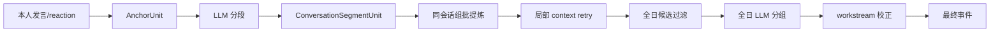

# WorkTrace 锚点优先设计演进记录

> 状态：历史设计与当前落地对照。当前正式流程请以 [detailed-design.md](detailed-design.md) 为准。

## 1. 最初目标

这份设计最初希望把旧的“大切片统一分析”改为：

1. 以本人直接参与信号构造较小锚点窗口
2. 先判断语义边界，再提炼事件
3. 信息不足时只补当前局部上下文
4. 对重复输入复用锚点结果
5. 最后再做跨锚点/跨会话合并

## 2. 当前落地状态

| 原设计项 | 当前状态 | 当前代码 |
| --- | --- | --- |
| `AnchorUnit` | 已进入正式主链 | `pipeline/anchors.py` |
| 本人消息锚点 | 已进入正式主链 | `group_anchor_units(...)` |
| 本人 reaction 锚点 | 已扩展并进入正式主链 | `reaction_catalog.py`、`pipeline/anchors.py` |
| 小范围锚点窗口 | 已进入正式主链，当前前后各 30 条 | `runner._analyze_segmented_conversations(...)` |
| LLM 先判断边界 | 已进入正式主链，输出 segment start IDs | `segment_conversation(...)` |
| 局部按需扩窗 | 已进入正式主链，作用于 segment | `_retry_segment_context(...)` |
| 附件/文档正文按需读取 | 已进入正式主链 | `ContentResolver` |
| 图片理解 | 模型明确请求后下载并摘要 | `vision.py` |
| 锚点失败回退 | 已进入正式主链 | `_analyze_anchor_fallback(...)` |
| 持久化锚点缓存 | 仍只在独立实验 | `anchor_experiment.py`、`cache/` |
| 只合并显式标记候选 | 未按原方案落地 | 正式主链仍对过滤后的全日候选分组 |
| 最终工作流归属校正 | 后续新增并进入正式主链 | `workstream_resolution.py` |

## 3. 当前正式流程与原设计的差异

主要差异：

- 正式主链不是“每个锚点直接提炼”，而是“锚点窗口先分段，再把片段组批提炼”
- `ConversationSlice` 没有完全删除，仍作为片段兼容和回退/扩窗载体
- 正式主链的持久化缓存没有启用，只保留单次运行内的分段窗口缓存
- 最终仍处理全日所有已过滤候选，不依赖 `needs_cross_anchor_merge` 来缩小 merge 范围
- 新增 `workstream_key` 和结构化工作流归属校正，解决仅靠语义相似分组的误合并/误拆分

## 4. 已验证的设计原则

当前代码继续遵循：

- Python 掌握真实消息时间线、ID 归属、边界扩展和最终物化
- LLM 只返回语义边界、候选事实和分组建议
- 上下文请求只扩展局部片段
- 附件正文不默认全量读取
- 分段失败应回退，而不是让单个窗口中断整天
- 跨会话合并必须经过 Python 覆盖校验和修复

## 5. 尚未进入正式主链的实验项

### 5.1 持久化锚点缓存

独立实验会按输入 fingerprint 复用锚点结果；正式日报尚未使用该缓存。后续接入时必须解决：

- reaction 目录版本变化如何使缓存失效
- 图片摘要、附件正文和链接正文如何进入 fingerprint
- prompt/schema 版本如何进入 fingerprint
- 缓存是否可能长期保留敏感上下文

### 5.2 缩小最终 merge 范围

原设计建议只合并 `needs_cross_anchor_merge=true` 的候选，当前没有采用。现在的工作流归属校正依赖全日候选上下文，贸然缩小范围可能漏掉跨会话同一事项。

后续优化需要用真实样本验证调用成本和事件质量，不能只按调用次数决定。

## 6. 实验指标

独立 `anchor_experiment` 当前保留：

- `cache_hit_count` / `cache_miss_count`
- `completion_mode_counts`
- `context_request_count`
- `candidate_event_count`
- `cross_anchor_merge_count`

这些指标只说明实验入口行为，不代表正式个人日报的 `batch_count` 或最终事件质量。

## 7. 后续调整原则

后续继续改锚点链路时，应先判断改动属于哪一层：

1. 会话发现与锚点信号
2. 锚点窗口和分段协议
3. 片段批处理和上下文扩展
4. 候选过滤
5. 跨会话分组与工作流归属
6. 缓存与可观测性

改动完成后同步 README、详细设计、对应专题文档和文档契约测试。
