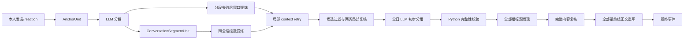

# WorkTrace 锚点优先设计演进记录

> 历史说明：本文涉及的工作流方案已被 [取消工作流概念并改进事件分组](workstream-free-event-grouping-design.md) 替代，正文不改写历史事实。

> 状态：历史设计与当前落地对照。当前正式流程请以 [detailed-design.md](detailed-design.md) 为准。

## 1. 最初目标

这份设计最初希望把旧的“大切片统一分析”改为：

1. 以本人直接参与信号构造较小锚点窗口
2. 先判断语义边界，再提炼事件
3. 信息不足时只补当前局部上下文
4. 对重复输入复用锚点结果
5. 最后再做跨锚点/跨会话合并

## 2. 当前落地状态

| 原设计项 | 当前状态 | 当前代码 |
| --- | --- | --- |
| `AnchorUnit` | 已进入正式主链 | `pipeline/initial_windows.py` |
| 本人消息锚点 | 已进入正式主链 | `build_initial_anchor_windows(...)` |
| 本人 reaction 锚点 | 已扩展并进入正式主链 | `reaction_catalog.py`、`pipeline/initial_windows.py` |
| 小范围锚点窗口 | 已进入正式主链，群聊按时间/无关插话聚合，私聊按当天整段 | `runner._analyze_segmented_conversations(...)` |
| LLM 先判断边界 | 已进入正式主链，输出 segment start IDs | `segment_conversation(...)` |
| 局部按需扩窗 | 已进入正式主链，作用于 segment | `_retry_segment_context(...)` |
| 附件/文档正文按需读取 | 已进入正式主链 | `ContentResolver` |
| 图片理解 | 本人发送或本人 reply/quote 关联图片首轮前摘要，其他图片按需处理 | `required_image_context.py`、`vision.py` |
| 锚点失败回退 | 已进入正式主链 | `_analyze_anchor_fallback(...)` |
| 实验锚点缓存 | 仍只在独立实验 | `anchor_experiment.py`、`cache/` |
| 正式任务续跑 | 已使用独立的临时分段/提炼中间结果 | `pipeline/llm_checkpoints.py` |
| 只合并显式标记候选 | 未按原方案落地 | 正式主链仍对过滤后的全日候选分组 |
| 旧工作流归属校正 | 曾进入主链，现已取消并由全日初步分组、标题发现、完整内容复核和全部最终组正文重写替代 | `pipeline/day_event_grouping.py`、`runner.py` |

## 3. 当前正式流程与原设计的差异

```mermaid
flowchart LR
    A["本人发言/reaction"] --> B["AnchorUnit"] --> C["LLM 分段"]
    C --> D["ConversationSegmentUnit"] --> E["同会话组批提炼"]
    C --> N["分段失败后窗口提炼"] --> F
    E --> F["局部 context retry"] --> G["候选过滤与两类局部复核"]
    G --> H["全日 LLM 初步分组"] --> I["Python 完整性校验"] --> J["全部组标题发现"]
    J --> K["完整内容复核"] --> L["全部最终组正文重写"] --> M["最终事件"]
```

主要差异：

- 正式正常路径是“锚点窗口先分段，再把片段组批提炼”；分段失败时才直接从窗口提炼
- `ConversationSlice` 没有完全删除，仍作为片段兼容和回退/扩窗载体
- 正式主链不读取实验锚点缓存；它按 `llm_mode` 和对应输入对象的 `to_dict()` 保存分段/提炼结果，供 `--resume` 续跑，成功写入 Markdown 后清理。指纹不包括模型名、完整提示词和规则配置；切模式或旧缓存缺少模式字段时不命中
- 最终仍处理全日所有已过滤候选，不依赖 `needs_cross_anchor_merge` 来缩小 merge 范围
- 不再使用工作流字段；全日分组直接返回多事件组与单例，Python 校验完整性后对全部组做标题发现，再对标题、结构和附件基础名称形成的检查范围执行完整内容复核，初步组可以拆开或跨组重组
- 候选在全日分组前先完成保留过滤，并对配置选中的候选执行临时协作复核和个人事实复核；分组锁定后，单成员组和多成员组都重新生成正文
- 正式线路由 `WORKTRACE_LLM_MODE` 选择，默认 Codex 主线路加 Online 备用，也可仅使用 Online

## 4. 已验证的设计原则

当前代码继续遵循：

- Python 掌握真实消息时间线、ID 归属、边界扩展和最终物化
- LLM 只返回语义边界、候选事实和分组建议
- 上下文请求只扩展局部片段
- 附件正文不默认全量读取
- 默认模式按阶段规则用尽分段重试后回退到窗口提炼；仅 Online 的终止请求错误直接传播，不进入这一回退
- 跨会话合并必须经过 Python 覆盖校验和修复

## 5. 尚未进入正式主链的实验项

### 5.1 实验锚点缓存

独立实验会按输入 fingerprint 复用锚点分析结果；正式日报不读取该缓存。实验指纹已有消息、锚点信号、附件/链接正文和固定 prompt/schema 版本标记，但不含运行模式、模型名称、完整提示词或完整规则配置，不能据此保证模型或配置变更后失效。缓存项长期保存候选正文、上下文请求和来源 ID，没有正式成功后的清理机制。扩窗后按扩展输入写入的缓存，也不保证能被下次初始输入查找命中。

正式日报现有的 `LLMCheckpointStore` 只临时保存话题切分和事件提炼结果，使用模式与输入对象指纹判断续跑，两者不能混用。若以后要把实验锚点缓存接入正式流程，需要先补齐配置失效、缓存生命周期和扩窗结果恢复规则。

实验首轮使用旧前后消息数量窗口并按 `anchor_batch_size` 组批，未采用正式按预算拆窗/装批、reaction 目录补全和候选验证。正常批量返回后立即保存，即使仍需上下文也不再扩窗；仅批量失败或结果缺失时进入逐锚点多轮。因此“已完成多轮实验”不能直接作为正式扩窗和失败处理的验收。

### 5.2 缩小最终 merge 范围

原设计建议只合并 `needs_cross_anchor_merge=true` 的候选，当前没有采用。现在的全日事件分组依赖全部已过滤候选的上下文，贸然缩小范围可能漏掉跨会话同一事项。

后续优化需要用真实样本验证调用成本和事件质量，不能只按调用次数决定。

## 6. 实验指标

独立 `anchor_experiment` 当前保留：

- `cache_hit_count` / `cache_miss_count`
- `completion_mode_counts`
- `context_request_count`
- `candidate_event_count`
- `cross_anchor_merge_count`

这些指标只说明实验入口行为，不代表正式个人日报的 `batch_count` 或最终事件质量。

## 7. 后续调整原则

后续继续改锚点链路时，应先判断改动属于哪一层：

1. 会话发现与锚点信号
2. 锚点窗口和分段协议
3. 片段批处理和上下文扩展
4. 候选过滤
5. 全日初步分组、标题发现、完整内容复核与全部最终组正文重写
6. 缓存与可观测性

改动完成后同步 README、详细设计、对应专题文档和文档契约测试。
