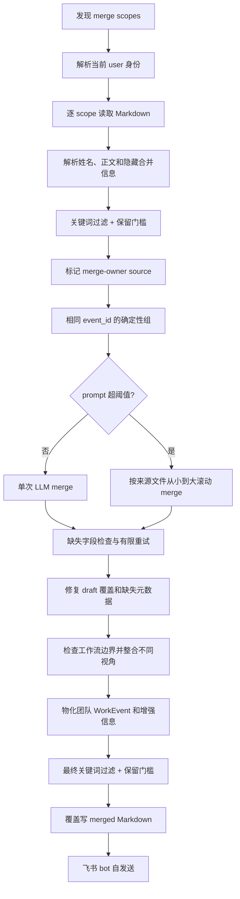

# WorkTrace 多人事件 Markdown 汇总设计

> 状态：正式 `merge-collected` 实现说明，不是未来计划。

## 1. 目标与边界

该链路面向已经收集到多人个人日报的管理人员。它只读取 WorkTrace Markdown 事件块，不重新读取员工聊天，也不做跨天合并。

正式命令：

```bash
python3 -m src.worktrace.cli merge-collected --date YYYY-MM-DD
```

该子命令独立执行，不复用个人日报的整套 preflight；运行中仍需要当前飞书 user 身份、在线 analyzer 配置、输入目录写权限和 bot 自发送能力。

## 2. 输入目录与 scope

```text
merge_inbox/YYYY/MM/DD/
├── YYYY-MM-DD-张三.md
├── 李四-YYYY-MM-DD.md
├── 上游-YYYY-MM-DD-merged.md
└── 项目A/
    ├── YYYY-MM-DD-王五.md
    └── 更深目录/              # 不递归
```

scope 规则：

- 日期根目录始终单独合并
- 每个非隐藏一级子目录单独合并
- scope 只读取当前层 `.md`
- 二级及更深目录不读取
- 隐藏文件、本次输出同名文件和旧 `_merged.md` 跳过
- 其他规范的上游 `*-merged.md` 可继续作为来源

每个 scope 在本目录生成：

```text
YYYY-MM-DD-登录人姓名-merged.md
```

## 3. 总流程



## 4. 来源文件解析

支持能解析出日期和姓名的文件名，例如：

- `YYYY-MM-DD-姓名.md`
- `姓名-YYYY-MM-DD.md`
- `姓名_YYYY-MM-DD.md`
- 规范化 `*-merged.md`

每个文件通过 `MarkdownEventStore.parse_day_document(...)` 回读。文件名无姓名、Markdown 结构非法或读取失败时跳过该文件并记录 warning，不影响同 scope 其他有效文件。

## 5. 来源过滤

每条来源 `WorkEvent` 在进入 LLM 前执行：

1. `filter_work_events(...)`：敏感词和排除词匹配，包含文件标题与 URL
2. `filter_retained_work_events(...)`：具体对象、保留理由和保留依据门槛

被过滤来源不会进入 prompt。

## 6. 合并人来源

当前 `lark-cli auth status` 的用户名是 merge owner。来源文件名解析出的姓名与其精确匹配时，该来源事件标记为 `is_merge_owner_source=true`。

同一真实事项包含 merge-owner source 时：

- 没有明确冲突时，正常整合所有人的不冲突事实、动作、结果、风险和待办
- 只有版本号、结论、状态、结果或待办方向明确冲突时，才采用 merge owner 来源
- 模型返回 `merge_owner_conflict` 和冲突说明，Python 写入运行 warning
- 最终正文只显示整合结果，不按人员逐条展示贡献

scope 有来源事件但没有匹配到 merge owner 时，系统写 warning 并回退为普通多人合并。

## 7. 增强合并信息与边界

个人 Markdown 的每条事件可提供：

- `workstream_name`
- `action_labels`
- `self_relations`
- `evidence_fingerprints`
- `file_keys`
- 现有标题、内容、具体对象、保留依据、文件、来源人员和来源事件 ID

合并规则：

- 两条事件都有非空工作流且名称不同：禁止合并，Python 会拆开模型误合并
- 工作流相同：只表示可能属于同一工作范围，不能直接合并
- 同一工作流下，共同消息指纹、共同文件、相同具体对象或连续动作是强证据，仍由模型结合内容确认
- 工作流为空的事件，可在共同消息、文件或明确业务对象支持下并入命名工作流
- 只有标题相似、时间接近或部门相同，不作为合并依据

旧 Markdown 没有增强信息时仍可参与合并，继续使用标题、内容、对象和文件判断。损坏的隐藏合并信息会被忽略并写 warning，不会导致整个来源文件失效。

## 8. 确定性预分组

Python 按稳定 `event_id` 聚合来源。相同 ID 的事件只有在标题/内容满足相似性规则时才锁定为确定性组；同 ID 但内容明显分歧时写 warning，并交给 LLM 判断。

确定性组是给模型的约束，不代表跳过后续验证。

## 9. 单次合并与滚动合并

系统先计算完整 prompt 字符数：

- 不超过 `collected_merge_prompt_char_threshold`：一次调用 `merge_collected_events(...)`
- 超过阈值：按来源文件 prompt 规模从小到大滚动合并

滚动过程把前一步中间事件作为下一步来源，持续保留：

- 来源人员
- 来源事件 ID
- merge-owner source 标记
- 文件链接
- 保留元数据
- 工作流名称、主要动作和协作方式
- 消息证据指纹和文件标识

中间结果只在内存中存在，最终只写一次规范化汇总文件。

## 10. 字段检查、重试与修复

模型返回后先统计 group 缺少或泛化的字段：

- title
- content
- object_hint
- retention_reason
- retention_detail

缺失比例达到 `collected_merge_missing_field_retry_ratio` 且未超过 `collected_merge_missing_field_retry_limit` 时，重新请求。环境变量可覆盖比例和次数。

最终 Python 还会：

- 修复遗漏、重复或未知 draft 引用
- 为遗漏 draft 补 singleton group
- 从来源事件回填具体对象、保留理由和保留依据
- 补回模型正文中遗漏的非冲突来源描述
- 拆开包含多个不同非空工作流的错误分组
- 对修复行为写 warning

## 11. 输出与追溯

团队 `WorkEvent` 在个人字段之外额外保留：

- `source_people`
- `source_event_ids`
- `workstream_name`
- `action_labels`
- `self_relations`，Markdown 显示为“协作方式”
- `evidence_fingerprints`
- `file_keys`

最终事件再次执行关键词过滤和保留门槛，再通过 `MarkdownEventStore` 写入当前 scope，并由飞书 bot 发给当前登录用户自己。

空目录、无有效文件或所有事件被过滤时，scope 可以生成空汇总并以 warning 说明原因。

## 12. Trace

开启：

```dotenv
WORKTRACE_COLLECTED_MERGE_TRACE=true
WORKTRACE_COLLECTED_MERGE_TRACE_ROOT=data/debug/collected_merge
```

每个 scope 会记录 step JSON、`summary.json` 和 `summary.md`，内容包括：

- prompt 字符数
- 来源文件/事件指标
- 本轮完整 `input_events` 和 `deterministic_groups`
- 原始 group 和字段缺失统计
- 重试、覆盖修复和元数据回填 warning
- 不同非空工作流强制拆组产生的 `boundary_warnings`
- 敏感/排除过滤和保留过滤结果
- 最终保留事件

## 13. JSON 结果

`CollectedMergeRunResult` 主要包含：

- `target_date`
- `input_dir`
- `output_path`
- `source_file_count`
- `source_event_count`
- `merged_event_count`
- `skipped_file_count`
- `warning_messages`
- `self_delivery_status`
- `self_delivery_target`
- `self_delivery_error`

有一级子目录时，根 scope 和子 scope 的结果会统一反映在本次运行摘要中。

## 14. 当前代码落点

- `src/worktrace/collected_merge.py`
- `src/worktrace/analyzers/prompts.py`
- `src/worktrace/analyzers/output_schemas.py`
- `src/worktrace/pipeline/sensitive_filter.py`
- `src/worktrace/pipeline/retention_filter.py`
- `src/worktrace/stores/markdown.py`
- `src/worktrace/delivery/feishu_cli.py`
