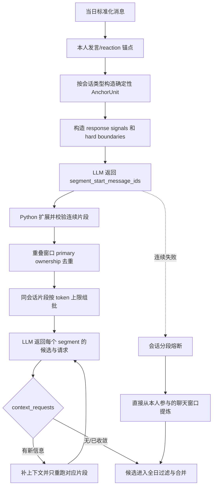

# WorkTrace 分段、扩窗与回退设计

> 状态：正式个人日报主链。`ConversationSlice` 仍是兼容和扩窗载体，但当前默认 Online analyzer 已改为“锚点窗口分段 + 会话内片段组批”。

## 1. 文档目标

本文档说明当前代码怎样把一个会话拆成可分析片段、怎样批量分析片段、怎样执行 `context_requests`，以及分段失败时怎样回退。

完整日流程见 [detailed-design.md](detailed-design.md)。

## 2. 当前处理单元

| 对象 | 当前作用 |
| --- | --- |
| `AnchorUnit` | 围绕本人发言或本人 reaction 构造的初始上下文窗口 |
| `ConversationSegmentUnit` | LLM 分段后由 Python 校验和扩展的连续工作片段 |
| `SegmentAnalysisBatch` | 同一会话内按 token 上限打包的多个片段 |
| `ConversationSlice` | 片段到旧分析/扩窗接口的兼容载体 |
| `ContextRequest` | 模型请求补消息、附件或链接正文的结构化控制信号 |

旧描述“一个会话 = 一个 slice = 一次首轮 LLM”已经不成立。

## 3. 主流程



## 4. 锚点窗口

`build_initial_anchor_windows(...)` 对每个会话分别构造窗口：

- 连续的本人消息形成文本锚点
- 本人做出的 reaction 形成响应锚点
- 群聊中相邻锚点间隔不超过 10 分钟、且中间无关消息不超过 3 条时合并为同一窗口
- 群聊窗口向前补 2 条时间上下文，并补齐当天可见的 reply/quote 直接关系
- 私聊把当天整段会话作为一个窗口，并补一层跨日 reply/quote 直接关系

这些阈值来自 `config/conversation_window.json`。`group_anchor_units(...)` 的固定前后条数窗口仍保留在兼容/实验代码中，但不是当前正式默认路径。

进入分段前还会补：

- reply/quote 关系
- 链接标题
- 附件元信息
- 已生成的图片摘要
- reaction 的本地中文说明和语义

进入分段模型前，Python 会按最终分段 prompt、`/no_think`、完整 JSON Schema 和结构化输出包装估算输入。超出 `model_input_batch_target_tokens` 时先按锚点拆分，再按连续消息拆分，并保留拆分窗口需要的直接 reply/quote 上下文；单条消息和必要协议字段组成的最小窗口仍超过目标时标记为 `oversized_singleton` 后发送，由模型服务决定是否接受。

## 5. 会话分段

### 5.1 模型输出

`segment_conversation(...)` 不直接返回完整片段，只返回：

```json
{
  "segment_start_message_ids": ["om_xxx", "om_yyy"]
}
```

这样模型只负责语义边界，片段成员仍由 Python 根据输入时间线计算。

### 5.2 Python 校验

`validate_conversation_segmentation(...)` 负责：

- 验证 start ID 存在于输入窗口
- 结合 hard boundary 扩展连续片段
- 建立 `primary_message_ids` 和 `context_message_ids`
- 计算本人证据与 response assessment
- 丢弃没有本人直接关联的片段
- 返回 warning，而不是信任模型任意引用

多个锚点窗口可能覆盖相同消息。`_dedupe_segment_primary_ownership(...)` 保证每条 primary message 只归一个片段，避免重复提炼。

## 6. 分段重试与熔断

每个锚点窗口最多尝试 `anchor_retry_limit + 1` 次。正式配置来自 `config/llm_retry.json`，当前首次分段之外最多额外重试 3 次；事件提炼也采用独立的 3 次额外重试限制。

单次运行内，相同窗口签名会复用内存中的分段结果。正式 CLI 还会把成功的话题切分和事件提炼结果临时写到 `data/cache/llm/YYYY/MM/YYYY-MM-DD/`；只有使用 `--resume` 时才复用输入完全一致的中间结果，正常重跑会先清理。Markdown 写入成功后该目录删除。

失败分为 analyzer 协议失败和分段校验失败；同一会话中同类失败达到 `conversation_segmentation_failure_threshold` 后打开熔断，剩余窗口不再重复请求。

熔断只停止该会话后续分段，不会直接终止整天。

## 7. 片段组批

校验后的 `ConversationSegmentUnit` 由 `pack_segment_units(...)` 按最终 prompt、`/no_think`、完整 JSON Schema 和结构化输出包装的合计估算分批。当前规则：

- 只在同一会话内组批
- 保持片段顺序
- 单个片段在本阶段仍超过目标时，`pack_segment_units(...)` 创建带 `oversized_singleton` 标记的单片段批次；analyzer 只允许带该标记的请求越过目标
- 每个批次都携带当前用户身份和 conversation 元数据

analyzer 返回 `BatchSegmentAnalysisResult`，必须对每个输入 `segment_id` 给出一项结果。Python 校验缺失、重复和未知 `segment_id`。

## 8. `context_requests`

### 8.1 支持类型

| 类型 | Python 行为 |
| --- | --- |
| `earlier_messages` | 以 `target_message_ids` 为边界向前读取同会话消息 |
| `later_messages` | 以 `target_message_ids` 为边界向后读取同会话消息 |
| `attachment_text` | 下载指定附件并按 `attachment_text.json` 提取文本 |
| `linked_file_text` | 读取指定飞书 Docx/Wiki 正文 |

### 8.2 作用范围

请求只扩展其 `segment_id` 对应的片段。一个批次内其他已完成片段不会因为某个片段缺上下文而一起重跑。

新增消息、附件正文和链接正文分别去重；扩展后的片段重新构造为单片段批次再请求。

### 8.3 停止条件

- 模型不再返回请求
- 请求没有带来新消息或正文
- 扩展前后签名相同
- 请求字段或引用 ID 无效
- 默认分段主链达到 `context_expansion_round_limit`（当前 2 轮）

每轮更早/更晚消息由 `context_expansion_messages_per_direction` 控制，当前每个方向最多 7 条。旧 analyzer 的会话级兼容路径仍使用 `slice_retry_limit`。达到上限时跳过仍要求更多上下文的片段并产生 warning；不能验证的结果不会强行进入后续流程。

## 9. 图片与文本附件边界

图片与文本附件采用不同策略：

- 图片：本人发送的图片，以及本人直接回复或引用目标消息中的图片，会在首次模型调用前下载和摘要；其他图片由模型按需请求，范围由 `config/image_summary.json` 控制
- 文本附件：模型明确请求后才读取，范围由 `config/attachment_text.json` 控制
- 飞书文档：模型明确请求后才读取正文

普通附件的文件名和 ID 属于消息元数据，不要求先读取正文。消息明确表示发送、查看、审核、转交或处理该附件时，候选可以引用该附件；系统不得根据文件名推断正文事实。无效附件引用会被移除，不会单独删除其他事实仍有效的候选。

图片摘要失败会跳过该图片并写 warning。文本附件/链接正文读取失败不会让模型获得虚构正文。

## 10. 分段失败后直接提炼

只要某个会话的聊天窗口最终无法完成分段，`_analyze_anchor_fallback(...)` 会改用直接提炼：

1. 对该会话的 `AnchorUnit` 分批
2. 调用 `analyze_anchor_batch(...)`
3. 校验 `anchor_status`、候选和上下文请求
4. 需要时执行锚点扩窗
5. 把有效候选并入正常分段得到的候选

这条备用路径继续使用 `ConversationSlice` 兼容模型做本人关联过滤和上下文扩展。

## 11. 调试产物

`--debug-output` 会记录：

- segmentation prompt、原始输出、校验片段和 warning；失败轮次保存 `failure.json`
- segment batch 输入、prompt、原始输出和候选统计；失败轮次保存 `failure.json`
- 批次失败后的单片段回退保存在 `fallback-01/`
- context retry 前后输入与请求
- 分段失败后直接提炼的输入输出保存在 `_anchor_fallback/`（代码内名称为 anchor fallback）

调试目录可能包含裁剪后的消息、图片摘要、附件正文和链接正文，仅用于临时排障。

## 12. 当前代码落点

- `src/worktrace/runner.py`
- `src/worktrace/pipeline/initial_windows.py`
- `src/worktrace/pipeline/conversation_segments.py`
- `src/worktrace/pipeline/context_expansion.py`
- `src/worktrace/pipeline/llm_checkpoints.py`
- `src/worktrace/pipeline/required_image_context.py`
- `src/worktrace/pipeline/anchor_expansion.py`
- `src/worktrace/analyzers/base.py`
- `src/worktrace/analyzers/online.py`
- `src/worktrace/analyzers/output_schemas.py`

## 13. 当前与独立实验的区别

正式日报已经使用本人参与的聊天窗口，并在分段失败后直接从这些窗口提炼。它不读取 `anchor_experiment.py` 的锚点缓存，也不输出实验统计；正式 CLI 的 `--resume` 使用的是另一套按精确输入指纹保存的临时分段/提炼中间结果。独立实验的命令、缓存命中率和 `completion_mode_counts` 只用于实验评估，不能用来描述正式日报产物。
