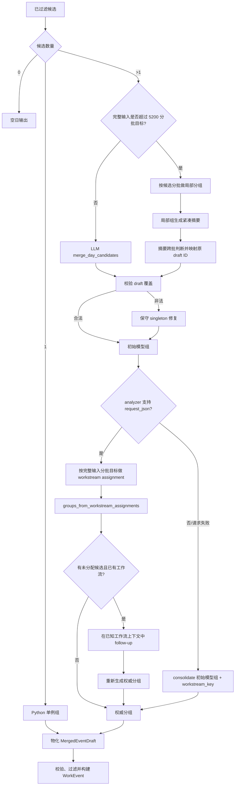

# WorkTrace 跨会话合并与工作流归属设计

> 状态：正式个人日报主链。本文档描述 `candidate_events` 形成之后、`WorkEvent` 物化之前的当前实现。

## 1. 为什么需要两次分组判断

同一工作事项可能同时出现在项目群、私聊、文档讨论群和交付群。片段分析只能提炼局部事实，不能独立决定全日候选的工作流归属。

当前 Online analyzer 路径包含两个不同任务：

1. `merge_day_candidates(...)` 做初始语义分组
2. `request_json(workstream assignment)` 对候选建立工作流权威分组

初始语义分组会先经过覆盖校验，但在 workstream assignment 成功时不会直接用于物化；它主要保留为 assignment 不可用或失败时的回退依据。

## 2. 输入边界

进入该阶段的 `SourceBackedEventDraft` 已通过引用 ID、本人直接关联、配置关键词和结构化保留门槛。

合并输入保留：

- `draft_id`
- `topic`、`content`
- `action_label`、`object_hint`
- `retention_reason`、`retention_detail`
- `source_message_ids`、`self_evidence_message_ids`
- `self_relations` 及每项的本人证据消息
- `referenced_link_ids`、`referenced_attachment_ids`
- `workstream_key`
- response outcome/evidence

全日分组不重新携带整段原始聊天。

## 3. 当前控制流



## 4. 初始语义分组

`merge_day_candidates(...)` 返回：

```json
{
  "groups": [
    {
      "group_id": "group-1",
      "draft_ids": ["draft-a", "draft-b"],
      "primary_draft_id": "draft-b"
    }
  ]
}
```

模型只提出哪些候选可能属于同一真实事项，不生成最终正文。

请求前按最终提示词、`/no_think`、完整 JSON Schema 和结构化输出包装估算输入。全部候选超过 `model_input_batch_target_tokens` 时，runner 按候选顺序组装到分批目标内；单候选批次直接形成单例组，其余批次分别调用 `merge_day_candidates(...)`。局部分组完成后，每组生成紧凑临时候选，再做一次跨批语义判断；临时候选只用于分组，最终结果必须映射回原始 draft ID。若摘要数量仍无法放入一次请求，则继续按相同目标分批；单个最小输入允许越过目标。

`validate_cross_conversation_groups(...)` 要求：

- 所有 draft ID 来自当前输入
- 每个候选恰好出现一次
- group 非空
- primary 位于本组

遗漏、重复或未知 ID 通过 `normalize_cross_conversation_groups_with_fallback(...)` 修复，避免候选静默丢失。

## 5. 工作流权威分组

### 5.1 首轮 assignment

analyzer 支持 `request_json(...)` 时，runner 调用 `build_workstream_assignment_prompt(...)`。全部候选无法一次放入分批目标时，按候选顺序继续组装成多个批次，再合并各批 assignment；单个候选本身仍超过目标时标记后发送，模型服务拒绝时转入失败回退。每项 `WorkstreamAssignment` 包含：

- `draft_id`
- `parent_draft_id`
- `root_workstream_name`
- `evidence_message_ids`

`groups_from_workstream_assignments(...)` 校验 assignment 并生成权威组。根节点的 `root_workstream_name` 会写入 `CrossConversationGroup.workstream_name`；该步骤不会重写候选事实，只决定父子归属和工作流 root。

### 5.2 未分配候选 follow-up

如果首轮留下未分配候选，且已经形成已知工作流，runner 构造 `known_workstream_context` 再请求一次。未分配候选的组合输入过大时也按同一分批目标继续组批；单个最小输入允许越过目标。

follow-up 约束：

- 只处理未分配候选
- 只能挂到已有 root
- 不允许创建新的工作流 root
- 返回范围外、重复或非法 assignment 会被忽略并写 warning

### 5.3 失败回退

以下情况会回退到 `consolidate_workstream_groups(model_groups, candidates)`：

- analyzer 没有 `request_json`
- 返回不是对象
- assignment 解析/验证失败
- 在线请求失败

回退逻辑参考候选已有 `workstream_key` 做保守整合，并把该名称作为最终工作流名称；单例候选也保留自身 `workstream_key`。

## 6. Python 物化

`materialize_grouped_merged_drafts(...)` 根据最终组：

- 选择 primary 候选
- 合并不冲突的标题、内容和元数据
- 合并并按当天消息顺序排列来源消息
- 合并 link/attachment 引用
- 按消息顺序去重合并 `action_label`
- 按 `config/event_metadata.json` 顺序去重合并 `self_relations`
- 保留或派生具体对象、保留理由、保留依据
- 保留工作流归属

随后 `validate_merged_event_drafts(...)` 再检查来源 ID 与排序。构建 `WorkEvent` 时，Python 对每个来源消息 ID 分别计算 SHA-256 证据指纹；文件链接和附件 ID 在文件聚合阶段生成稳定文件标识。

## 7. 合并后过滤

`MergedEventDraft` 物化后仍依次执行：

1. 配置敏感词/排除词过滤
2. 结构化保留门槛
3. `build_work_events(...)`
4. 文件证据聚合
5. 最终事件配置关键词过滤
6. 最终事件保留门槛

文件标题和 URL 只在最终事件层可见，因此最终过滤不能省略。

## 8. 调试

`--debug-output` 的 `_merge_day_candidates/` 下会记录：

- `input.json` / `prompt.txt` / `output.json`：初始语义分组
- `workstream_resolution_*`：首轮 assignment
- `workstream_resolution_followup_*`：未分配候选 follow-up
- `resolved_groups.json`：最终用于物化的分组和 warning

排查误合并/误拆分时，应先看 `resolved_groups.json` 和 workstream assignment。只有 assignment 失败回退时，初始模型组才直接影响最终结果。

## 9. 当前代码落点

- `src/worktrace/runner.py`
- `src/worktrace/pipeline/cross_conversation_merge.py`
- `src/worktrace/pipeline/workstream_resolution.py`
- `src/worktrace/pipeline/validation.py`
- `src/worktrace/analyzers/prompts.py`
- `src/worktrace/analyzers/output_schemas.py`
- `src/worktrace/pipeline/event_merge.py`

## 10. 设计边界

- 只处理同一目标日期
- 初始语义组和工作流组是不同协议，不应混写
- LLM 负责语义归属，Python 负责覆盖、引用、回退和物化
- 拿不准时保守拆开
- 不依赖群名或人名作为最终工作流判断
- 不把原始聊天重新送入全日分组
