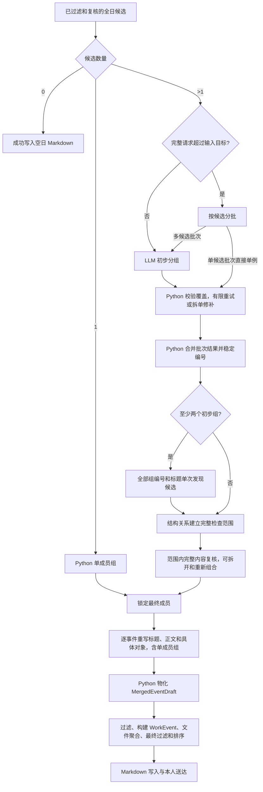

# WorkTrace 跨会话事件分组与物化设计

> 状态：当前 4.1.0 的正式个人日报主链。历史工作流归属方案已由 [取消工作流概念并改进事件分组](workstream-free-event-grouping-design.md) 替代；本文正文以当前代码为准，不再保留旧方案作为实现指引。

## 1. 目标与边界

同一工作事项可能出现在项目群、私聊和交付群。片段分析先提炼局部候选，随后全日分组判断哪些候选属于同一项可以独立汇报的业务事项。

分组不建立已取消的工作流根事件或父子事件树，也不根据群名、人员或相近时间直接合并。语义规则来自 `config/event_grouping.json`，模型判断业务关系，Python 校验编号、完整覆盖和证据归属。

本阶段只处理同一目标日期，不重新读取整段原始聊天，不负责多人 Markdown 汇总。多人链路见 [collected-people-merge-plan.md](collected-people-merge-plan.md)。

## 2. 输入边界

进入本阶段的 `SourceBackedEventDraft` 已经过引用与本人证据校验、配置关键词过滤、结构化保留门槛，以及命中条件的临时协作复核和个人事实复核。

Python 内部继续保留完整候选及其来源信息。`build_merge_prompt(...)` 实际向初步分组模型发送每个候选的：

- `draft_id`
- `topic`、`content`
- `action_label`、`object_hint`
- `source_message_ids`
- `referenced_link_ids`、`referenced_attachment_ids`

初步分组不发送候选的会话 ID、片段 ID、本人参与项、保留理由或保留依据，也不发送附件和链接正文。目标日期、共同分组规则、理由定义及正反例放在请求公共部分。

后续完整内容复核会增加原片段 ID、初步组和结构关系，仍使用候选正文与证据编号，不重新读取整段聊天。

## 3. 当前控制流


```mermaid
flowchart TD
    A["已过滤和复核的全日候选"] --> B{"候选数量"}
    B -->|"0"| C["成功写入空日 Markdown"]
    B -->|"1"| D["Python 单成员组"]
    B -->|">1"| E{"完整请求超过输入目标?"}
    E -->|"否"| F["LLM 初步分组"]
    E -->|"是"| G["按候选分批"]
    G -->|"多候选批次"| F
    G -->|"单候选批次直接单例"| H
    F --> H["Python 校验覆盖，有限重试或拆单修补"]
    H --> I["Python 合并批次结果并稳定编号"]
    I --> J{"至少两个初步组?"}
    J -->|"是"| K["全部组编号和标题单次发现候选"]
    J -->|"否"| L["结构关系建立完整检查范围"]
    K --> L
    L --> M["范围内完整内容复核，可拆开和重新组合"]
    M --> N["锁定最终成员"]
    D --> N
    N --> O["逐事件重写标题、正文和具体对象，含单成员组"]
    O --> P["Python 物化 MergedEventDraft"]
    P --> Q["过滤、构建 WorkEvent、文件聚合、最终过滤和排序"]
    Q --> R["Markdown 写入与本人送达"]
```

## 4. 初步分组与预算

`_merge_day_candidates_with_batching(...)` 使用统一生产估算器：估算用的最终 prompt 包括合法参数示例、当前重试反馈和 `/no_think`；Online 估算加入完整 Function 定义和 `tool_choice`，Codex 估算加入完整 output-schema，取两者较大值作为分批依据。

`model_input_batch_target_tokens` 在默认模式按 `config/model_input_budget.json` 的主模型和备用模型组合精确选择模型预算 profile。配置不存在、组合未匹配或使用 `online_only` 时采用 `default_target_tokens`，当前回退 `7000`。它是输入估算目标，不是 HTTP 字节数或服务端上下文上限。

超限时按候选原始顺序分批，单候选批次直接形成单成员组，其余批次分别请求。Python 直接合并批次结果并检查全量覆盖，不生成临时候选摘要，也不做摘要再次分组。跨批可能遗漏的关系由全量标题发现和完整内容复核处理。

## 5. Function 输出与校验

初步分组只返回 `merged_groups` 和 `singleton_draft_ids`。示例：

```json
{
  "merged_groups": [
    {
      "draft_ids": ["draft-a", "draft-b"],
      "primary_draft_id": "draft-a",
      "common_object": "同一份具体交付物",
      "semantic_reasons": ["continuous_action"],
      "reason_detail": "确认结果直接用于后续执行。",
      "member_connections": [
        {
          "draft_id": "draft-a",
          "connection_detail": "确认交付方案。",
          "evidence_message_ids": ["om_a"]
        },
        {
          "draft_id": "draft-b",
          "connection_detail": "依据方案反馈执行结果。",
          "evidence_message_ids": ["om_b"]
        }
      ]
    }
  ],
  "singleton_draft_ids": ["draft-c"]
}
```

模型不生成 `group_id`。Python 根据候选顺序生成稳定内部编号；只有一个全日候选时直接使用内部组 `single`。

`parse_personal_grouping_function_payload(...)` 和 `validate_cross_conversation_groups(...)` 检查：

- 全部候选恰好出现一次，不允许未知、遗漏或重复编号。
- 多事件组至少包含两个候选，primary 必须在本组。
- 共同对象、理由说明和逐成员说明非空，语义理由来自配置。
- 成员说明完整且唯一，每项证据只来自该成员自己的来源消息。
- 顶层及成员结构符合严格契约，不允许多余字段。

全部候选保留为单例是合法结果。

## 6. 请求失败与质量重试

两种模式共用该分组流程：

- `codex_with_fallback`：每个新请求先走 Codex；可重试技术错误按 `primary_request_retry_limit` 额外重试，当前为 1 次，仍失败时由配置合法的 Online 备用执行一次。
- `online_only`：只用 Online 主线路，可重试技术错误同样额外重试 1 次，没有备用切换。

初步分组的技术请求失败直接终止个人日报，不写新 Markdown。结构或覆盖非法则按 `day_group_validation_retry_limit` 对当前主线路额外重试，当前为 1 次，并携带 Python 具体错误；默认模式仍非法且备用可用时，提交 Online 当前请求备用一次。

持续非法或没有可用备用时，`normalize_cross_conversation_groups_with_fallback(...)` 保留完全合法且互不冲突的组，其余候选拆成单例，记录 warning。修补结果仍必须满足完整唯一覆盖。

这些边界仅描述全日初步分组。默认模式的分段、提炼和两类个人复核还有各自外层重试，不能把本节请求次数当作整次日报的调用上限。

## 7. 标题发现与完整内容复核

有至少两个初步组时，`day_group_discovery` 一次提交全部组编号和组合标题。组输入只有 `group_id` 和 `title`；组合标题覆盖组内全部候选标题。即使超过预算目标，也按不可拆清单整体提交。输出 `group_checks` 必须按输入顺序覆盖每个组，关联编号合法、无自关联和重复，理由非空。Python 将重叠关系组合为标题候选范围。

`pipeline/day_event_grouping.py` 再结合以下结构关系建立完整检查范围：同一片段、直接 reply/quote、共享消息、共享稳定文件标识，以及去掉配置版本后缀后基础名称与扩展名相同的非图片附件。同一天同一会话本身不触发个人复核。

范围内模型可以保持原组，也可以拆开后重新组合，返回分组及逐条 `relation_resolutions`。Python 校验候选完整唯一覆盖、每条关系均被处理、合并成员确实同组、分开代表成员位于不同组，以及关系两侧证据归属。

不同范围按配置最多三路并行，同一范围内重试顺序执行。标题发现最终失败时按没有标题候选继续；完整复核最终失败时保留该范围复核前分组。两者均写 warning，不阻止后续正文、Markdown 和本人送达。

## 8. 内容重写与 Python 物化

最终成员锁定后，`_render_personal_multi_groups(...)` 虽保留旧方法名，实际对单成员和多成员组都逐事件调用 `personal_group_render`。模型只生成带 `fact_items` 的标题、正文和具体对象，必须覆盖全部锁定成员。按配置最多三路并行；技术或质量尝试最终失败时，仅当前事件使用确定性来源内容并告警。

`materialize_grouped_merged_drafts(...)` 随后：

- 使用合法重写结果；没有结果时选 primary 标题并按来源顺序去重拼接正文。
- 按来源消息顺序去重动作，按配置顺序去重本人参与方式。
- 从来源候选派生保留理由和依据，合并来源消息与会话 ID。
- 合并链接、附件引用，不生成已取消的工作流字段。

`validate_merged_event_drafts(...)` 检查来源 ID 与排序。合并草稿继续执行配置关键词过滤和结构化保留门槛，再由 `build_work_events(...)` 生成稳定事件 ID、每条消息的 SHA-256 证据指纹，以及目标日期和来源会话的 SHA-256 会话指纹。文件聚合仅附加有来源与文本依据的文件，随后执行最终过滤和输出排序。

## 9. 调试与统计

`--debug-output` 的 `_merge_day_candidates/` 下记录：

- `input.json` / `prompt.txt`：候选输入和首次分组提示词。
- `grouping_attempts.json`：请求线路、返回、校验错误和拆单修补。
- `day_group_discovery.json`：全量编号标题、估算、尝试和候选范围。
- `day_group_review.json`：完整检查范围、关系处理、尝试与保留决定。
- `personal_group_render.json`：锁定成员、重写结果与失败回退。
- `resolved_groups.json`：最终合法分组、warning 和 `day_grouping_summary`。

失败范围单独重放生成 `day_group_review_replay.json`，不直接修改正式 Markdown。新 trace 不生成已取消的工作流归属请求。

`DayGroupingSummary` 的数量由 Python 计算，当前备用统计字段为 `fallback_count`，旧 trace 的 `codex_fallback_count` 仅作为兼容输入。正式续跑只缓存分段和提炼，不缓存本阶段的分组或正文重写。

## 10. 当前代码与验证落点

- 编排与失败处理：`src/worktrace/runner.py`。
- 提示词、严格 Function 和协议解析：`src/worktrace/analyzers/prompts.py`、`function_calls.py`、`output_schemas.py`、`protocol.py`。
- 覆盖校验与修补：`src/worktrace/pipeline/validation.py`。
- 标题与结构关系、范围内重新组合：`src/worktrace/pipeline/day_event_grouping.py`。
- 物化与事件指纹：`src/worktrace/pipeline/cross_conversation_merge.py`、`event_merge.py`。
- 现有验证：`tests/integration/test_runner_cross_conversation_merge.py`、`tests/unit/test_day_event_grouping.py`、`tests/unit/test_llm_modes.py`。
