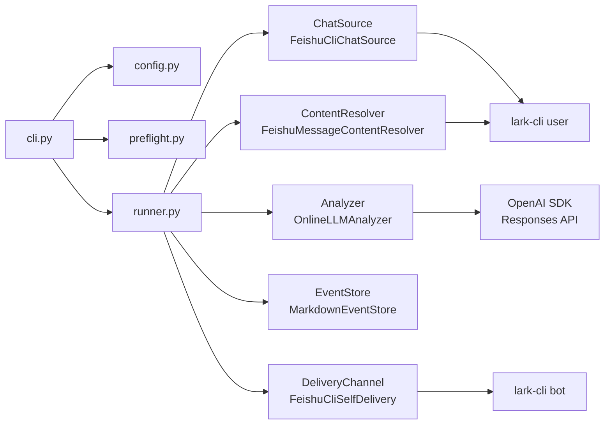
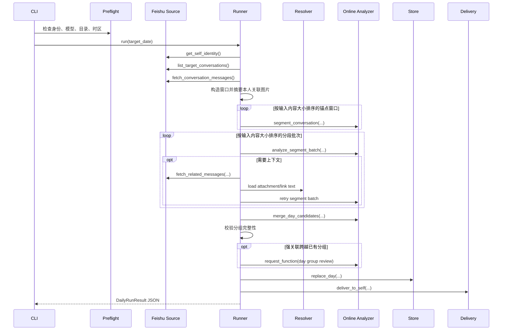
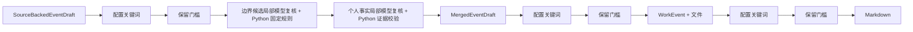
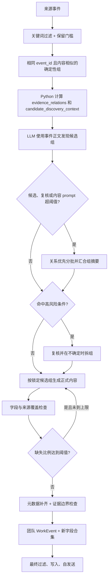

# WorkTrace 详细设计

## 1. 文档定位

本文档以当前代码为准，描述 WorkTrace 的正式入口、个人日报主链、多人汇总主链、数据边界、失败回退、过滤层和产物。历史设计稿只用于解释演进，不应覆盖本文档中的当前行为。

## 2. 产品与信任边界

WorkTrace 解决的是员工对当天工作沟通的结构化回顾问题。个人日报只从当前用户直接参与的飞书沟通中提取事件，先在本地生成 Markdown，再通过飞书 bot 发给本人审阅。

明确边界：

- 个人日报会通过本机 `lark-cli` 读取当前用户可见的聊天
- 裁剪后的消息正文、会话名、发送者信息、消息和会话标识、链接 URL/标题、附件文件名、按需读取的附件/文档正文和启用范围内的图片会进入用户配置的在线模型服务
- 为补齐 reply/quote 直接关系或按需扩展相邻上下文，个人日报可能临时读取目标日期之外的直接关联消息；事件日期仍固定为目标日期
- 正式模式默认不长期落盘原始聊天，但 `--debug-output` 会落盘裁剪后的上下文和模型结果
- 默认投递目标是当前用户本人，不是领导
- 多人汇总只读取已收集 Markdown，不重新读取成员原始聊天
- 系统不承诺“零数据外发”或“绝对安全”

## 3. 正式入口

| 命令 | 入口 | 前置行为 | 主要产物 |
| --- | --- | --- | --- |
| `python3 -m src.worktrace.cli --date YYYY-MM-DD` | 个人日报 | 加载规则/黑名单并自动 preflight | `data/YYYY/MM/YYYY-MM-DD-姓名.md` |
| `python3 -m src.worktrace.cli --date YYYY-MM-DD --resume` | 续跑个人日报 | 保留输入未变化的分段/提炼中间结果 | 同上 |
| `python3 -m src.worktrace.cli --preflight` | 仅自检 | 不生成日报 | JSON 检查结果 |
| `python3 -m src.worktrace.cli merge-collected --date YYYY-MM-DD` | 多人汇总 | 独立执行，不走个人日报 preflight | 每个 scope 的 `*-merged.md` |
| `python3 -m src.worktrace.cli sync-reaction-catalog --source feishu` | reaction 同步 | 独立执行 | 本地目录 JSON 和 PNG |

`cli.py` 统一负责日期校验、配置覆盖、JSON 输出和退出码。退出码约定：成功为 `0`，运行失败为 `1`，输入日期非法为 `2`。

## 4. 架构与依赖装配



`factories.py` 建立五个主要依赖边界：聊天源、内容解析器、analyzer、store、delivery。当前默认实现均为飞书 + Online analyzer，但抽象接口保留替换空间。

## 5. 个人日报主链

### 5.1 总体时序



### 5.2 会话发现

`FeishuCliChatSource.list_target_conversations(...)` 使用两次搜索：

1. 按当前用户 `open_id` 搜索本人当天发送的消息
2. 搜索当天消息，识别当前用户当天做过的 reaction

二者任一命中的会话都会进入候选，`excluded_conversation_ids` 在此阶段直接排除。随后 `fetch_conversation_messages(...)` 按会话、按时间升序分页读取当天消息。

这意味着当前范围不是简单的“本人当天发过消息的会话”；本人当天只做 reaction 的会话也可能进入分析。

### 5.3 消息标准化与基础过滤

消息标准化形成 `NormalizedMessage`，保留：

- 消息和会话 ID
- 发送者、发送时间和类型
- 清洗文本
- reply/quote 关系
- 链接元数据
- 附件元数据
- reaction 及其操作者/时间

随后从 `config/reaction_catalogs/feishu.json` 补充 reaction 名称、说明和语义。进入 LLM prompt 前不保留 reaction 操作者标识，只保留当前处理需要的响应信号；但 prompt 仍会包含当前用户标识、会话名/会话 ID、消息 ID，以及消息发送者姓名或缺省时的发送者内部标识。消息中的裸链接会在正文中压缩，但链接 URL、标题和临时引用 ID 仍作为结构化元数据发送。

`pipeline/filtering.py` 在 LLM 前过滤系统类消息、撤回、群信息变化、无文本且无链接/附件的空消息。

### 5.4 图片摘要

默认内容解析器装配 `OnlineImageSummarizer`。`config/image_summary.json` 启用时：

1. 首轮前先摘要本人发送的图片，以及本人直接回复或引用目标消息中的图片
2. 这些图片摘要直接进入话题切分与事件提炼输入；目标消息在当天窗口外时一并补入
3. 其他图片仅在模型判断依赖图片内容时返回 `attachment_text` 请求
4. 临时下载图片，并按字节上限筛选；按需图片另受数量上限限制
5. 用当前在线模型、`detail=low` 生成工作内容摘要，并作为 `AttachmentTextBlock` 补回当前片段

同一消息图片在单次运行内复用摘要。失败只产生 warning，临时目录结束后删除，不阻断日报。

### 5.5 锚点窗口

当前正式路径由 `pipeline/initial_windows.py` 以两类信号形成 `AnchorUnit`：

- 当前用户发送的消息
- 当前用户做出的 reaction

群聊先把连续本人消息组成文本锚点，再把相邻文本/reaction 锚点按 `config/conversation_window.json` 聚合。当前条件为：相邻锚点间隔不超过 10 分钟，且中间无关消息不超过 3 条；窗口向前补 2 条时间上下文，并补齐窗口内可见的 reply/quote 直接关系。私聊先把当天整段会话作为一个窗口，再补一层跨日 reply/quote 直接关系。窗口进入模型前先生成分段任务专用 Function、当前合法消息 ID 参数示例和最终 prompt，再用统一估算器取 Online 完整 Function 请求与 Codex 完整 output-schema 输入的较大值；超限时优先按锚点拆，再按连续消息拆，并为拆出的窗口保留直接 reply/quote 上下文。单条消息和必要协议字段组成的最小窗口仍超限时标记后发送。

旧的 `pipeline/anchors.py` 固定前后条数窗口仍保留给兼容/实验路径，但 `use_initial_conversation_windows=True` 的正式默认流程不再使用 `before_limit=30`、`after_limit=30`。

### 5.6 LLM 分段与 Python 校验

对每个锚点窗口，analyzer 只返回 `segment_start_message_ids`。Python 根据不可变时间线扩展成连续片段，并执行：

- 起始 ID 必须存在于输入窗口
- 每个片段必须覆盖有效 primary message
- 片段必须具备本人发言、本人 reaction、reply/quote 或明确指派证据
- hard boundary 不能被模型随意跨越
- 重叠锚点窗口的 primary message 只能归一个片段

分段结果形成 `ConversationSegmentUnit`，再兼容转换成 `ConversationSlice` 供上下文扩展与调试使用。

### 5.7 分段组批与候选提炼

同一会话的多个片段由 `pack_segment_units(...)` 按完整模型输入估算打包成 `SegmentAnalysisBatch`。估算包含最终提示词、合法参数示例、重试反馈、`/no_think` 和动态 ID 枚举，并取 Online Function 定义与 `tool_choice`、Codex 完整 output-schema 两种输入估算的较大值。组合输入超过 `model_input_batch_target_tokens` 时继续拆分；单个片段仍超过目标时标记为 `oversized_singleton` 后发送。该估算覆盖调用前客户端已知输入；服务端精确 `usage.input_tokens` 只用于事后核对。每个结果必须按 `segment_id` 返回：

- `candidate_events`
- `context_requests`

候选 `SourceBackedEventDraft` 的核心字段：

- `topic`、`content`、`action_label`
- `object_hint`
- `retention_reason`、`retention_detail`
- `source_message_ids`
- `self_evidence_message_ids`
- `self_relations`：参与方式英文键和对应的本人证据消息 ID
- `referenced_link_ids`、`referenced_attachment_ids`
- reaction 响应结果相关字段

参与方式允许值、中文名和顺序来自 `config/event_metadata.json`。Python 校验所有引用 ID 均来自当前片段输入；`self_relations` 的证据还必须属于当前片段的本人参与证据。非法类型、跨片段证据或他人消息证据只删除对应参与项并写 warning，不删除整个候选。之后 Python 重新绑定 `draft_id`、会话 ID 和片段 ID，不能信任模型生成的内部标识。

附件文件名会作为消息元数据进入 prompt。消息明确表示发送、查看、审核、转交或处理附件时，模型可以引用来源消息中的附件 ID；这不代表系统读取了附件正文，也不能据文件名推断正文事实。模型误把消息 ID 当附件 ID 且该消息只有一个附件时，Python 会修复引用；其他无效附件引用会被移除，但候选的其余有效事实仍保留。

话题切分和事件提炼完成后分别写入 `data/cache/llm/YYYY/MM/YYYY-MM-DD/`。文件保存完整输入及其 SHA-256 指纹，只复用输入完全一致的结果。默认运行在 preflight 通过后先删除旧个人日报、当天中间结果和 `data/debug/conversations/<date>/` 当天个人调试目录；`--resume` 保留这三类产物，并只复用输入完全一致的中间结果。Markdown 成功写入后，中间结果会清理，因此该目录只用于未完成任务续跑，不是长期数据仓库。

### 5.8 上下文请求与重试

分段分析支持四类请求：

- `earlier_messages`：围绕目标消息补更早消息
- `later_messages`：围绕目标消息补更晚消息
- `attachment_text`：下载并读取指定文本附件
- `linked_file_text`：读取指定飞书 Docx/Wiki 正文

扩展只作用于请求所属片段；新增内容合并去重后重新分段并分析相关片段。更早/更晚消息的读取以目标消息为边界，不额外限制在目标日期内，因此午夜附近的扩展可能包含跨日消息。默认分段主链按 `context_expansion_round_limit` 停止，当前最多扩展 2 轮；每个方向单轮最多取 7 条消息。旧 analyzer 的会话级兼容路径仍使用 `slice_retry_limit`。其他停止条件包括无新信息、签名未变化或协议无效。

文本附件限制来自 `config/attachment_text.json`，当前只支持配置中的文本扩展名，不做通用二进制文档解析。

### 5.9 分段失败后直接提炼

每个锚点分段最多尝试 `anchor_retry_limit + 1` 次。相同输入窗口使用内存缓存避免重复调用；同一会话中同类失败达到 `conversation_segmentation_failure_threshold` 后打开熔断，不再继续请求剩余锚点分段。

只要某个聊天窗口最终无法完成分段，该会话还会执行 `_analyze_anchor_fallback(...)`：本人参与的聊天窗口先按锚点和消息尽量拆到分批目标内，再同时按 `anchor_batch_size` 和锚点提炼专用 Function 的完整输入估算组批，直接提炼事件，并继续支持补充上下文。最小窗口仍超过目标时允许单独发送。直接提炼的候选和正常分段得到的候选之后进入同一过滤链。

### 5.10 候选过滤

候选先后经过：

1. `filter_candidate_drafts(...)`：配置敏感词/排除词包含匹配
2. 旧 analyzer 路径的 `filter_self_related_candidate_drafts(...)`：本人直接关联兜底；分段路径已在分段校验中处理
3. `filter_retained_candidate_drafts(...)`：结构化保留门槛

保留理由必须是六个枚举之一；具体对象不能是空值或过度泛化；保留依据必须足够具体；个人隐私/请假、社交口碑、普通行政审批和泛化“完成审核”等低价值事件会被拒绝。

### 5.11 临时协作局部复核

`pipeline/retention_review.py` 在候选过滤之后、全日分组之前运行。只有 `config/retention_policy.json` 配置命中的候选才进入复核；当前默认条件为：`retention_reason=follow_up_assigned` 且没有链接和附件。没有候选时不调用模型。

职责边界如下：

- 首次事件提炼和既有参与检查确认本人是否真实参与，但“本人参与”不能单独证明事件值得保留
- analyzer 读取候选对应的原聊天，只返回 `routine_signals`、`substantive_signals` 和真实 `evidence_message_ids`
- analyzer 不返回最终保留/删除决定，也不参与任何数量或比例计算
- Python 不读取聊天文字判断临时协作含义，只检查 draft 完整性、信号类型和消息证据归属，再执行固定规则

固定规则为：任一合法实质工作信号优先保留；只有临时协作信号时删除；两类合法信号都没有时按 `uncertain_policy` 处理，当前为删除。两类信号同时存在时保留。这里不增加面向所有聊天的排除词，语义信号说明和既有业务词统一维护在 `config/retention_policy.json`，不硬编码进 Python。

复核使用保留复核专用 Function，按统一完整输入估算以 `model_input_batch_target_tokens=5200` 为目标分批。组合候选超过目标时继续拆分，单个候选仍超过目标时标记后发送。模型明确拒绝输入时直接失败且不重试；模型漏回、重复返回、字段不完整、信号类型非法或证据消息不属于当前候选时，只重试当前批次，并把具体错误反馈给模型。重试反馈导致超限时标记 `oversized_retry` 后发送。重试后仍错误或发生技术失败时，整次运行返回 `failed`，不写 Markdown。正常语义删除不产生 warning。

`DailyRunResult.retention_review_summary` 由 Python 计算 `selected_candidate_count`、`reviewed_candidate_count`、`kept_candidate_count`、`dropped_routine_count`、`dropped_uncertain_count`、`review_batch_count` 和 `review_retry_count`，并随 CLI stdout JSON 输出。Markdown 不增加字段。

旧个人 MD 和既有部门汇总不追溯处理。只有重新生成个人日报才会应用新复核规则；`merge-collected` 不读取原聊天，也不对来源 Markdown 补做该复核。

### 5.12 个人事件事实证据与局部复核

首次候选提炼除现有字段外，还返回：

- `fact_items`：`field`、`text`、`evidence_message_ids`，覆盖 `topic`、`content`、`action_label`、`object_hint` 和 `retention_detail`
- `fact_risk_flags`：只能使用 `config/retention_policy.json` 中配置的风险信号

正文可以拆成多项事实，但所有 `content` 事实按顺序直接连接后必须与最终正文完全一致。其他非空字段各有一项完全相同的事实文字。首次校验只做字符串覆盖、字段类型和消息 ID 归属检查，不判断消息是否在语义上支持某个地点、对象、责任人或结论。

`pipeline/personal_fact_review.py` 在临时协作复核之后、全日分组之前运行。满足任一条件就复核当前事件：事实证据缺失或不完整、来源消息达到 8 条、来源参与人达到 3 人，或模型返回多个对象、对比案例、多个地点、责任归属、推断决策等配置风险信号。消息数和参与人数由 Python 确定性统计；风险含义由模型依据配置判断。没有候选时不增加模型调用。

复核模型重新读取当前候选的原聊天，只返回 `supported`、固定字段结构的 `fact_items` 和 `removed_claims`。标题、正文、主要动作、具体对象和保留依据只在 `fact_items` 中出现一次，不在外层重复；协议解析器再从这唯一来源派生文字字段。它可以确认原文，也可以删除或改写无依据内容；多人、多地点、多步骤本身不能作为删除理由。每个请求固定只包含一个候选，动态 Function 参数结构把 `draft_id` 固定为当前候选，并把每个证据消息 ID 限制为当前候选的 `allowed_evidence_message_ids` 枚举；Python 继续严格校验结果数量为 1。Python 执行以下固定检查：

- 当前 `draft_id` 必须且只能返回一次
- `fact_items` 必须包含协议固定位置，正文可拆成有序数组，其他位置各一个对象
- 每项证据消息必须属于当前候选可用的原聊天；Function 参数枚举和 Python 归属检查同时生效
- Python 派生的标题、正文、动作、对象和保留依据必须被事实项完整覆盖
- `supported=false` 时事实文字和证据必须为空，并提供被删除表述

Python 不阅读聊天文字判断对比案例、责任人或流程建议，只接收模型的结构化结果并执行 `unsupported_policy`。原聊天无法同时支持非空标题、正文、具体对象和保留依据时删除；复核技术失败、漏回、重复、字段不完整、非法消息 ID 或覆盖不完整时只重试当前候选，重试反馈明确列出错误字段和 ID，重试后仍错误则整次个人日报 `failed` 且不写文件。不同候选通过线程池最多同时处理 `config/llm_retry.json` 配置的 3 条，同一候选内部的重试仍然串行。每个请求使用个人事实复核专用 Function，并按统一完整输入估算以 `model_input_batch_target_tokens=5200` 为分批目标；单个候选允许越过目标，模型明确拒绝输入时不重试。

`DailyRunResult.personal_fact_review_summary` 由 Python 计算选择数、复核数、确认数、修订数、无依据删除数、批次数和重试数。统计进入 CLI stdout JSON 和调试文件 `personal_fact_review.json`，不增加 Markdown 可见字段。

### 5.13 全日事件分组与强关联漏合并复核

候选多于一条时先估算全日分组的完整输入。未超过 `model_input_batch_target_tokens` 时保持单次请求；超过目标时按候选顺序分批完成局部分组，再由 Python 为每个局部组构造最多 `prompt_message_char_limit` 字符的临时摘要，摘要保留主候选标题、具体对象、正文首尾和原始 draft ID 映射。模型继续判断这些摘要是否属于同一事项，Python 最后展开回全部原始 draft ID。摘要仍过多时继续按相同目标分批，单个候选批次直接保留为单例。

全日分组提示词不发送候选的 `source_conversation_id` 和 `source_slice_id`。模型只能读取标题、正文、主要动作、具体对象、来源消息 ID 和文件引用；`config/event_grouping.json` 中完整的理由说明、成立条件、排除条件和负面示例随请求发送。同一会话不同事项的示例明确要求拆开，拿不准时返回单例。

全日分组 Function 顶层只返回 `merged_groups` 和 `singleton_draft_ids`。每个多事件组包含 `draft_ids`、`primary_draft_id`、`common_object`、`semantic_reasons`、`reason_detail` 和 `member_connections`；逐成员说明必须与组内候选一一对应，并各自引用该成员自己的来源消息。稳定 `group_id` 由 Python 按候选顺序生成。Python 校验两个数组完整且互斥、每个候选恰好出现一次、主事件属于当前组、理由来自配置、成员说明无遗漏或重复、证据属于对应候选；多余字段也视为协议错误。全部单例是合法结果。

结果非法时执行以下固定边界：

1. Online 带 Python 具体校验错误重试当前请求 1 次。
2. 仍非法时，把当前请求交给 Codex 1 次，下一请求仍优先 Online。
3. Codex 技术调用失败时终止生成。
4. Codex 返回但仍非法时，`normalize_cross_conversation_groups_with_fallback(...)` 保留完全合法组，其余候选拆成单例并记录 warning。

初始分组通过后，`pipeline/day_event_grouping.py` 依据同一 `source_slice_id`、直接 reply/quote、共享来源消息和共享文件建立强关联；同一会话本身不触发。强关联跨越已有分组时形成局部组件，最多按 `max_concurrent_day_group_review_requests=3` 并行复核。复核只能合并完整已有组，`validate_day_group_review_result(...)` 拒绝拆散任何已合法组。复核失败或持续非法时保留复核前分组并记录 warning。

个人分组规则和多人合并理由共同读取 `config/event_grouping.json`。Python 不读取聊天文字判断业务含义，只负责关系构造、结构校验、完整性和统计。最终分组直接物化为 `MergedEventDraft`，动作按消息顺序去重，参与方式按配置顺序去重。`DayGroupingSummary` 由 Python 计算候选数、初始/最终组数、复核组件和请求数、校验重试、Codex 备用、拆单修补候选数和 warning 数。

### 5.14 最终事件、文件证据和排序

合并草稿再次经过配置关键词和保留门槛，然后由 `build_work_events(...)` 形成 `WorkEvent`。主要动作和参与方式沿链路保留；`event_id` 基于日期、归一化来源消息集合和内容稳定生成。

文件聚合不把会话中所有链接和附件都附上，而是检查：

- 模型明确返回的 link/attachment 引用
- 来源消息是否包含该文件
- 事件标题、内容、对象、保留依据是否有足够文件证据
- 事件文本是否精确写出了同来源会话中的附件文件名

Python 对每个来源消息 ID 单独计算带命名空间的 SHA-256 证据指纹，并对“目标日期 + 来源会话 ID”计算同日会话指纹。会话指纹让不同员工引用同一讨论中的不同消息时仍能在多人合并阶段建立候选关系，但不会自动强制合并。文件链接去掉 query 和 fragment 后计算文件标识，附件使用附件 ID 计算；只有文件名而没有稳定标识时不生成。最终链接会隐藏敏感 query 参数；无 URL 附件使用 `《文件名》`。事件按其来源消息在当天时间线中的位置排序。

### 5.15 存储、空日与投递

`MarkdownEventStore.replace_day(...)` 覆盖写入：

```text
data/YYYY/MM/YYYY-MM-DD-姓名.md
```

无会话、无消息、候选被全部过滤或最终事件为空，都走成功空覆盖并生成合法 Markdown。

写入后 `FeishuCliSelfDelivery` 规范化发送文件名，使用 bot 身份向当前 user `open_id` 发送文件。发送错误不会删除已写入文件，运行状态变为 `success_with_warnings`。

## 6. 三层过滤模型



| 层级 | 敏感/排除检查字段 | 结构化门槛 |
| --- | --- | --- |
| 候选 | 标题、内容、主要动作、具体对象、保留依据 | 必须有合法理由、具体对象和具体依据 |
| 合并草稿 | 标题、内容、主要动作、具体对象、保留依据 | 合并后重新检查 |
| 最终事件 | 标题、内容、主要动作、具体对象、保留依据、文件标题、URL | 写入前最后检查 |

标题生成要求：脱离正文也能识别具体事项，优先采用“具体对象 + 关键动作、进展、结果或风险”的结构，避免只写通用类别。该要求用于个人候选提取、补充分析和多人正式汇总。

`config/event_rules.json` 是敏感、普通排除和本人指派关键词的配置入口；`config/retention_policy.json` 保存个人保留提示、既有业务词、临时协作复核、事实复核条件和模型语义信号说明。新增或调整业务词不得硬编码到 Python。`retention_filter.py` 执行结构化保留门槛，`retention_review.py` 和 `personal_fact_review.py` 只验证模型信号、字段覆盖和证据归属并执行固定规则，Python 不通过新增聊天关键词判断临时协作或事实含义。

## 7. 多人汇总

### 7.1 Scope 发现

`CollectedMergeRunner.run(...)` 以 `merge_inbox/YYYY/MM/DD/` 为日期根目录：

- 根目录始终是一个 scope
- 每个非隐藏一级子目录各自是一个 scope
- 每个 scope 只读取当前层 `.md`
- 更深目录跳过
- 隐藏文件、本次输出同名文件和 `_merged.md` 跳过
- 其他上游 `*-merged.md` 仍可作为输入

### 7.2 来源解析与合并人来源

文件名必须能解析目标日期和姓名。Markdown 必须符合 `MarkdownEventStore` 格式。无效文件跳过并写 warning，不阻断其他文件。

来源姓名与当前登录用户名精确匹配时标记 `is_merge_owner_source=true`。只有不同来源存在明确事实冲突，模型才标记 `merge_owner_conflict=true`，Python 才采用合并人版本并写 warning；没有冲突时必须整合所有来源的有效补充。未匹配到合并人来源时直接执行普通合并，不写 warning。

### 7.3 合并策略



多人合并候选发现默认发送来源 MD 中的完整事件正文。Python 根据共同消息、共同文件形成 `evidence_relations`，并在每个滚动批次或高风险复核请求的内存中，仅把数量大于零的关系编号为 `MSG-xxx`、`FILE-xxx`；不创建临时目录或独立文件。编号清单只进入模型上下文供判断。同日会话候选放在 `candidate_discovery_context.same_conversation_candidate_sets` 中，使用 `candidate_set_id` 而不是输出分组的 `group_id`，并明确只用于发现候选、不得复制为合并组。多人提示词同时读取配置中的负面示例；没有确定性组时，另用不含真实 draft ID 的占位结构展示 `member_connections`。新模型输出只返回 `semantic_reasons`、`reason_detail`、逐条覆盖全部成员的 `member_connections` 和 `risk_flags`，不再返回 `evidence_relation_ids`，也不能直接声明 `shared_message`、`shared_file` 或内部 `group_reason`。Python 在分组后排除端点位于组外的关系，再按稳定目录顺序选择能够连接全部成员的最小关系集合，消息和文件可以共同组成连接链；成功后才恢复内部原因和兼容旧 trace 的 `evidence_relation_ids`。局部证据只写审计；没有完整证据且没有合法语义理由时返回 `merge_reason_missing`，有局部证据但覆盖不足时返回 `evidence_does_not_cover_group`。即使消息或文件集合完全相同也不能自动合并，模型仍须结合具体对象和前后动作判断。

`config/collected_merge.json` 是多人合并中文判断规则的唯一来源。每个 `group_reason_definitions` 项配置 `acceptance_rules` 和 `rejection_rules`；Python 只读取规则供提示使用，并负责编号、证据连接、覆盖和标准化字段比较，不硬编码业务关键词。`member_connections` 必须与组内 `draft_ids` 完全一致，遗漏、重复、未知编号、空说明、重复组员和单成员合并组都作为结果质量错误，不静默修复。

单条候选直接保留，不进入高风险复核。多条候选在来源事件达到 10 条、来源文件达到 4 个、跨批、Python 修复、同一会话连接了多个没有共同消息或共同文件的部分、无完整共同证据且标准化后的非空 `object_hint` 不一致，或模型标记 `broad_object` 时增加高风险复核，最多三路并行并保持原候选顺序。对象不一致只触发复核，不自动拆组；对象一致或已有完整证据时不增加这项复核。候选和复核使用独立 Function 示例，高风险复核示例采用保守拆分，不预填原组或 `same_object`。每个多事件子组必须有合法关系依据、自己的 `reason_detail` 和完整 `member_connections`，单条组不要求。复核拆组时只要求一条顶层 `split_reason` 解释整体差异；旧记录只要任一子组有非空理由也兼容接受，所有位置都无理由时拒绝拆分、保留原组并写告警。协议错误反馈包含错误组、重复编号、证据端点、缺失成员，并要求补入缺失成员或删除该合并。结果质量错误固定走 Online 首次请求、Online 局部重试 1 次、Codex 当前请求备用 1 次；最后仍失败时终止本次合并。调试模式只增加记录，不改变线路和次数。

候选、复核和正式正文使用各自任务专用 Function，并调用同一生产估算函数：`prepared_prompt` 包含最终提示词、当前合法参数示例、证据编号、重试错误反馈和 `/no_think`；`online_estimate` 再加入完整 Function 定义与 `tool_choice`，`codex_estimate` 再加入完整 output-schema，最终取两者较大值。估算器区分 ASCII 和非 ASCII 字符，并为混合中文 JSON、动态编号及协议固定开销留出余量。`model_input_batch_target_tokens=5200` 是模型输入估算目标，不是 HTTP 字节数或服务端上下文上限。每尝试加入一个候选都重新构建并估算；复核超过目标时按关系分批，单条正文仍过长时复用正文切片和分层摘要；不可继续拆分的最小输入允许发送。校验错误只重试当前请求，加入具体错误后重新估算，超限时标记 `oversized_retry` 后发送。正式内容必须返回完整 `covered_draft_ids` 和 `fact_items`；Python 检查整批 draft 分配、锁定组和事实来源，模型明确拒绝输入或结果仍不完整时当前 scope 失败且不写文件。若 scope 目录已有同名历史输出，失败不会删除或覆盖旧文件，是否成功必须以本次 CLI JSON 为准。调试 step 在 Python 校验失败时标记 `validation_failed`，`failed_step_indexes` 同时包含调用失败和校验失败；候选分组还保存解析前的 `raw_function_payload`，用于检查被解析器丢弃的非法结构。

部门负责人和中心负责人复用同一个 `merge-collected` 命令，当前代码没有自动的层级编排。第一级由部门负责人收集本部门 v2 个人 MD 后运行；第二级由中心负责人收集各部门 `*-merged.md` 后再次运行。个人 MD 和部门 MD 可以同时作为输入，程序不比较两者的 `source_event_ids`，不拦截，也不提示重复来源。输出名始终取当前飞书登录人姓名。一级子目录是并列 scope，不会自动把子目录输出再送入根目录。上游汇总继续保留原始来源人员和事件 ID，并从 `*-merged.md` 文件名提取上一级负责人；中心公开输出显示 `来源负责人`，来源事件 ID 仅保存在隐藏信息中。

合并边界：共同消息、共同文件、同日会话和语义理由只用于发现和说明候选关系，最终仍由模型确认是否属于同一事项。标题相似、部门相同、来源负责人相同或同一会话都不能单独证明是同一事件。

### 7.4 可追溯性

团队事件额外保留：

- `source_people`
- `source_event_ids`
- `source_report_owners`
- `action_labels`、`self_relations`
- `evidence_fingerprints`、`conversation_fingerprints`、`file_keys`

候选阶段若模型遗漏 draft，Python 会补 singleton group；单条修复组直接保留，只有多条修复组才可能进入高风险复核。正式正文阶段不修补覆盖缺口。若非正文字段缺失或过度泛化，可从来源事件派生 `object_hint`、`retention_reason`、`retention_detail` 并记录 warning。

每个 scope 和整次运行都生成 Python 计算的 `quality_summary`，同时进入 CLI JSON、trace `summary.json` 和 `summary.md`。事件数和字符数比例只用于人工查看；一个人部门或没有重复事项时允许输出数等于输入数。

## 8. Analyzer 与模型协议

默认链路：

```text
OnlineLLMAnalyzer -> openai Python SDK -> Responses API provider
```

固定结构的正式语义请求：

- prompt 追加 `/no_think`
- `WORKTRACE_LLM_REASONING_EFFORT=none` 时发送 `reasoning.effort=none`
- 会话分段、事件提炼、保留复核、事实复核、全日分组、强关联局部复核、多人候选分组、高风险复核、正式内容生成和表情元数据补全分别构造 `FunctionCallSpec`
- 参数完整声明必填字段、动态 ID 枚举、数组数量与去重约束和 `additionalProperties:false`，并在 prompt 中加入当前合法 ID 的典型参数示例
- Online 设置 `strict:true` 和强制 `tool_choice`，非流式必须且只能调用一次预期 Function；流式按调用 ID 拼接 Function 参数后执行相同检查
- Codex 继续使用同一参数结构作为 `--output-schema`
- 普通文字总结和图片理解不要求固定结构时不强制 Function Calling

`WORKTRACE_LLM_STREAM` 是唯一流式开关，默认 `false`。每个 Online 文字、图片和 preflight 请求都会重新读取当前配置，创建并关闭独立 OpenAI 与 HTTP 客户端；不保留全局单例、配置指纹或锁。preflight 使用真实 Function Calling 探针，服务不支持时直接报错。

`CodexAnalyzer` 是非默认备选。runner 根据 analyzer 是否提供分段能力决定主链；不支持时回退到会话级 `ConversationSlice` 兼容路径。

## 9. 配置分层

### 9.1 `RuntimeConfig`

主要默认值：

- `timezone = "Asia/Shanghai"`
- `analyzer_backend = "online"`
- `online_request_retry_limit = 1`
- `anchor_retry_limit = 3`
- `anchor_batch_retry_limit = 1`
- `conversation_segmentation_failure_threshold = 2`
- `reaction_discovery_page_limit = 3`
- `model_input_batch_target_tokens = 5200`（模型输入估算目标；统一取 Online 完整 Function 请求和 Codex 完整 output-schema 估算的较大值，最小输入可以越过目标，服务端精确 token 只用于事后核对）
- `max_anchor_gap_minutes = 10`
- `max_unrelated_intervening_messages = 3`
- `initial_context_messages_before = 2`
- `context_expansion_messages_per_direction = 7`
- `context_expansion_round_limit = 2`
- `codex_request_interval_min_seconds = 0.0`
- `codex_request_interval_max_seconds = 1.0`
- `max_concurrent_collected_merge_review_requests = 3`
- `high_risk_review_enabled = True`
- `high_risk_source_event_count = 10`
- `high_risk_source_file_count = 4`
- `review_semantic_only_object_conflicts = True`
- `review_broad_object_groups = True`
- `slice_retry_limit = 3`
- `anchor_batch_size = 3`
- `llm_stream_enabled = False`
- `llm_reasoning_effort = "none"`

### 9.2 `.env` 与环境变量

模型连接必填项只有 `WORKTRACE_LLM_BASE_URL`、`WORKTRACE_LLM_MODEL`、`WORKTRACE_LLM_API_KEY` 三项。`WORKTRACE_LLM_REASONING_EFFORT` 未配置时使用 `RuntimeConfig.llm_reasoning_effort = "none"`；显式配置为其他值会被 preflight 拒绝。timeout/stream/TLS 位于 `.env` 或进程环境变量，环境变量优先；下一次请求重新读取后生效。在线文字请求不等待；可切换失败按 `online_request_retry_limit=1` 只让当前请求再试 Online 1 次，仍失败才改由 Codex 执行，下一请求继续在线优先。请求级重试次数和 Codex 间隔都在 `config/llm_retry.json` 统一控制。`WORKTRACE_LLM_TLS_VERIFY` 只进入 preflight 和文本 analyzer 的 HTTP client；图片摘要使用独立 SDK client 及其默认的证书校验行为。

多人汇总 trace 和字段缺失重试也支持环境覆盖：

- `WORKTRACE_COLLECTED_MERGE_TRACE`
- `WORKTRACE_COLLECTED_MERGE_TRACE_ROOT`
- `WORKTRACE_COLLECTED_MERGE_MISSING_FIELD_RETRY_RATIO`
- `WORKTRACE_COLLECTED_MERGE_MISSING_FIELD_RETRY_LIMIT`

### 9.3 JSON 配置

- `config/event_rules.json`：三类业务关键词
- `config/event_metadata.json`：主要动作和参与方式的英文键、中文显示名和排序
- `config/conversation_blacklist.json`：整会话排除
- `config/conversation_window.json`：初始窗口聚合和按需扩窗阈值
- `config/llm_retry.json`：Online 请求级重试、分段/提炼/全日分组结果质量重试、流式首次返回超时、Codex 间隔，以及切分、提炼、个人事实复核、强关联局部复核和多人高风险复核并发数
- `config/retention_policy.json`：个人保留提示、既有业务词、临时协作复核、个人事实复核条件和模型信号定义
- `config/event_grouping.json`：个人与多人共同分组说明，以及合并理由的描述、成立条件和排除条件
- `config/collected_merge.json`：多人汇总高风险复核开关、阈值和条件
- `config/attachment_text.json`：文本附件限制
- `config/image_summary.json`：图片摘要限制和 prompt
- `config/reaction_catalogs/*.json`：reaction 语义目录

## 10. Markdown 契约

个人事件先以 `### 序号. 事件标题` 显示标题，公开字段顺序为日期、主要动作、内容、具体对象、本人参与方式、保留理由、保留依据、涉及文件。主要动作中的已知内部英文键由 `config/event_metadata.json` 映射为中文，未配置的中文自由动作原样保留。

机器字段：

- front matter：`date`、`event_count`、`generated_at`、`generator`
- event HTML 注释：稳定 `event_id`
- retention HTML 注释：内部枚举
- `merge_meta` HTML 注释：v2 版本、参与方式英文键、消息证据 SHA-256、按“目标日期 + 来源会话 ID”生成的同日会话 SHA-256、文件标识 SHA-256，以及非空的来源事件 ID 和来源负责人

团队汇总把“本人参与方式”显示为“协作方式”，公开保留来源人员，并把来源事件 ID 写入隐藏 `merge_meta`。存在上游负责人时额外显示“来源负责人”，并在 `merge_meta` 保存 `source_report_owners`。读取器兼容旧 Markdown 中重复的“事件标题”、可见的“来源事件 ID”，以及缺少新增隐藏字段的旧 V2 文件；旧 Markdown 中的工作流字段允许读取但会丢弃。缺少会话证据的 V1 文件仍不能参与多人合并，必须重新生成；新输出仍用“未明确”表示缺少可见业务字段。损坏的 `merge_meta` 被忽略并写 warning，不影响正文解析。多人汇总遇到尾部残缺事件时保留此前完整事件并增加 `partial_file_count`，但不修改来源文件；没有完整事件或其他结构无效时整份跳过。Markdown store 同时负责回读，因此字段名或注释结构变化必须同步解析器和多人汇总测试。

LLM 中间缓存指纹使用 schema v3；旧缓存不复用、不迁移，避免旧字段进入新链路。新 Markdown、缓存和 trace 不生成工作流字段；旧 trace 只由调试工具兼容读取并标记为旧版。

## 11. 状态、warning 与错误

个人日报结果包含会话数、消息数、slice 数、模型调用批次数、事件数、跳过数、warning 数、输出路径、自发送状态，以及 Python 计算的 `retention_review_summary`、`personal_fact_review_summary` 和 `day_grouping_summary`。

规则：

- 模型、聊天源或 store 的主错误返回 `failed`
- 非关键窗口失败、图片摘要失败、模型分组修复、事件过滤和发送失败进入 warning
- 临时协作复核的正常删除不进入 warning；技术失败或协议重试耗尽返回 `failed` 且不写文件
- 个人事实复核的正常确认、修订或无依据删除不进入 warning；技术失败或协议重试耗尽返回 `failed` 且不写文件
- 全日分组结果持续非法时保留合法组并拆单修补其余候选；强关联局部复核失败时保留原分组，两者都写 warning
- 有 warning 或跳过片段时返回 `success_with_warnings`
- 空日是成功结果，不是失败

## 12. 调试与可观测性

`--debug-output` 将个人日报调试根目录设置为 `data/debug/conversations/<date>/`。落盘对象覆盖：

不带 `--resume` 的个人重跑会在新流程开始前删除当天旧目录，不影响其他日期和 `data/debug/collected_merge/`；带 `--resume` 时保留当天旧目录。

- segmentation
- segment batch
- context retry
- 分段失败后的直接提炼（代码内名称为 anchor fallback）
- `_merge_day_candidates/input.json` 与 `prompt.txt`：全日候选和首次提示词
- `grouping_attempts.json`：每次线路、模型结果、Python 校验错误和拆单修补
- `day_group_review.json`：强关联组件、各次局部复核、校验错误和保留决定
- `resolved_groups.json`：稳定最终分组、warning 和 Python 计算的 `day_grouping_summary`
- `retention_review.json`：临时协作复核每次尝试的候选摘要、证据范围、模型信号、覆盖统计和协议错误，不额外复制原聊天正文
- `personal_fact_review.json`：个人事实复核的触发原因、修订前后字段、事实证据覆盖、Python 统计及每次失败返回，不额外复制原聊天正文
- `final_events.json`：过滤后的合并草稿、文件聚合和排序完成后的 `WorkEvent`、最终阶段 warning
- `llm_usage.json`：每次文字调用的线路、成功或失败、切换方向、安全错误类别、耗时和输入字符数；在线线路保留 Responses API token，Codex 明确标记 token 不可用

segmentation 和 segment batch 的模型失败轮次保存输入、prompt 与 `failure.json`。批次拆分后的单片段回退保存在片段目录的 `fallback-01/`；分段耗尽后的直接提炼保存在 `_anchor_fallback/<conversation>/<anchor-key>/attempt-XX/`。成功轮次继续保存输出和校验结果，异常轮次不伪造模型输出。

`scripts/replay_day_with_trace.py` 生成的 `summary.json` 通过 `review_artifact_summary` 汇总两类事实复核，通过 `day_grouping_artifact_summary` 汇总新分组文件，并优先从 CLI 结果、其次从 `resolved_groups.json` 读取 `day_grouping_summary`；旧 trace 缺少新文件时保持不可用，不补造数据。`llm_usage_summary` 从 `llm_usage.json` 汇总准确的调用类型、次数、token、累计耗时、平均耗时和最长单次耗时。

`scripts/report_replay_timings.py` 按 `request_kind` 展示调用统计；`analyze_segment_batch` 是并发提炼批次累计工作量，`analyze_segment_batches_all` 是事件提炼真实墙钟耗时；`personal_fact_review` 是并发候选累计工作量，`personal_fact_review_all` 是事实复核真实墙钟耗时。`stage_totals` 只为真实墙钟或非并发阶段计算运行时间占比，并发累计记录不计算占比；旧 trace 缺少事件提炼整体字段时返回 `wall_clock_ms=null` 与 `wall_clock_available=false`。全日分组分别报告 `day_candidate_merge` 初始请求累计耗时、`day_group_review` 局部复核累计耗时、`day_group_review_all` 局部复核墙钟耗时和 `merge_day_candidates` 总墙钟耗时；`--baseline-trace-root` 由 Python 计算差值，并发请求不能相加为实际耗时。

`scripts/report_replay_call_inputs.py` 会把分段、提炼、分段失败后的直接提炼、两类事实复核、全日初始分组和每次强关联局部复核写入 `call-input-report.md`；旧 trace 中的调用标为“旧版工作流归属”，新 trace 不生成该类别。在线模型成功响应数分为文字与图片摘要，调试文件保存的是文字调用尝试，两种口径不要求相等。`scripts/report_event_grouping_comparison.py` 读取基线与当前 trace，输出候选覆盖、分组数量、合并或拆分的候选关系、强关联复核结果、理由和证据；它只做结构与关系统计，不判断业务语义。

多人汇总 trace 写 `source-audit.json`、step JSON、`step-NNN-prompt.txt`、`summary.json` 和 `summary.md`。每个模型请求前先保存输入和 prompt；成功、失败、结果质量重试和自送达失败都会留下 summary。候选和复核 step 使用 `grouping_protocol_version: 2`，并按组保存 `evidence_audit`、`semantic_audit` 和 `python_validation.errors`；旧 trace 回放可额外记录 `model_declared_evidence_relation_ids`，但新流程不使用它。step 还记录输入估算、实际 token、Function、证据目录、拆分理由、调用记录、`input_events`、`deterministic_groups`、正文覆盖和 `boundary_warnings`。两个 summary 文件保存 Python 计算的 `quality_summary`、校验错误、重试原因、复核触发、各线路调用数和耗时、切换数以及 Codex 等待统计，因此可以从来源增强信息追到最终部门事件并核对各级数量和覆盖率。

`scripts/replay_collected_review_failures.py` 保留失败清单的 `--inventory`、`--ids`、`--result-dir` 和 `--output-dir`，并新增 `--trace-root`、`--steps`，可直接离线回放候选分组和高风险复核 step。旧 trace 使用 `legacy_audit` 展示原错误和新证据算法结果，不补造 `member_connections`；新实验结果使用 `current` 完整执行协议 v2 校验。汇总按阶段统计重复编号、单成员合并、理由缺失、证据越界、覆盖不足、逐事件说明缺失和新增复核触发次数，`summary.md` 显示“旧结果问题、新规则处理、是否仍需模型复核”。脚本明确记录 `model_call_count: 0`，不调用模型，也不生成正式 Markdown。

所有主阶段同时通过 `logging_utils.log_timing(...)` 输出耗时和数量字段。在线和 Codex 记录都显式携带 `request_kind`；在线没有等待日志，Codex 等待单独进入调用记录；并发分段、事件提炼、事实复核和强关联局部复核都同时记录批次累计口径和整体墙钟口径。

## 13. 已知边界

- 图片摘要依赖当前模型支持图片输入；失败只跳过摘要
- 图片摘要不复用文本 analyzer 的 HTTP client，因此不读取 `WORKTRACE_LLM_TLS_VERIFY` 的开关值
- 文本附件只支持配置中的小型文本扩展名
- 飞书链接正文当前只处理可识别的 Docx/Wiki
- 多人汇总的大输入采用关系优先分批和组摘要汇合，单次请求仍受 provider 能力限制
- 正式日报只临时持久化分段与提炼中间结果，成功写入 Markdown 后即清理；独立实验的锚点缓存是另一套机制
- 正式流程不做跨日归并和自动调度

## 14. 文档维护规则

行为变化时至少同步：

1. `README.md` 的用户可见流程
2. 本文档的阶段、数据和失败边界
3. 对应专题文档
4. `tests/unit/test_docs_contract.py` 的关键契约

专题文档必须在开头标明它描述的是正式主链、回退路径、独立实验还是历史设计，避免再次把设计稿当成当前代码。
