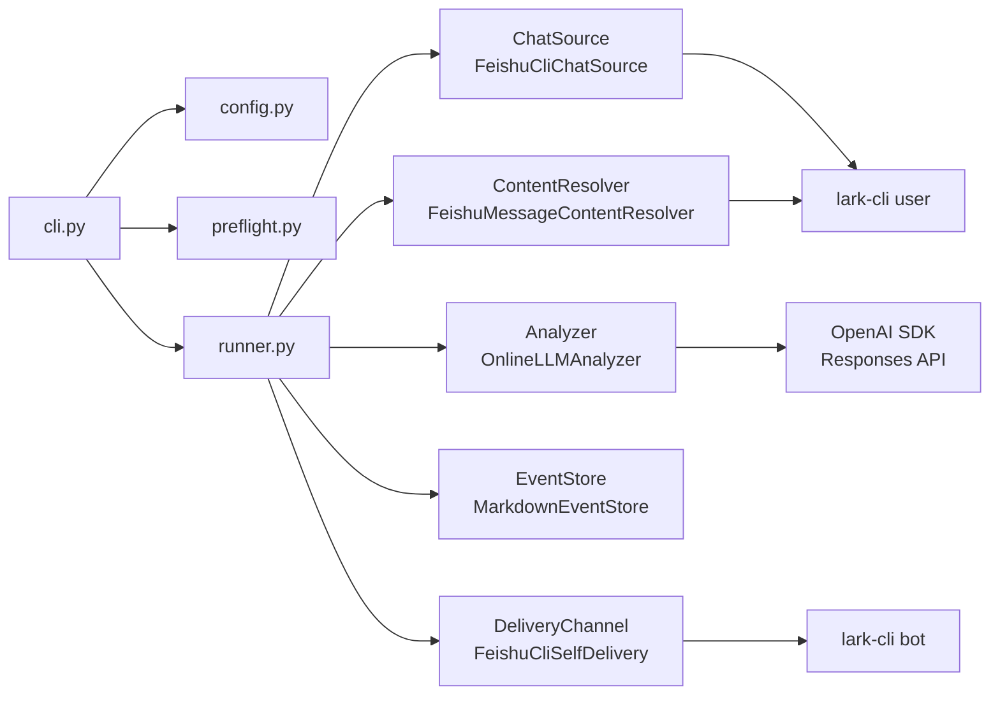
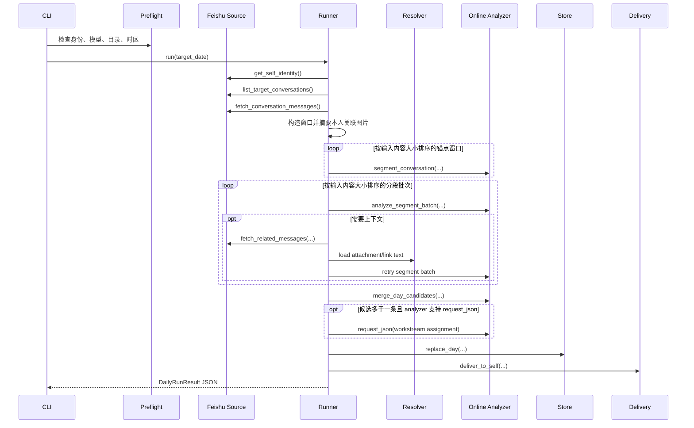
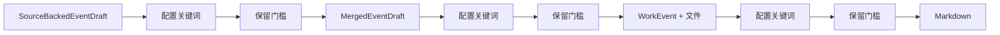
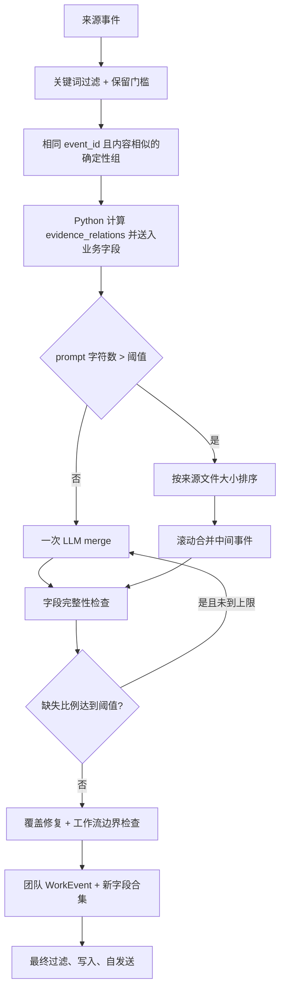

# WorkTrace 详细设计

## 1. 文档定位

本文档以当前代码为准，描述 WorkTrace 的正式入口、个人日报主链、多人汇总主链、数据边界、失败回退、过滤层和产物。历史设计稿只用于解释演进，不应覆盖本文档中的当前行为。

## 2. 产品与信任边界

WorkTrace 解决的是员工对当天工作沟通的结构化回顾问题。个人日报只从当前用户直接参与的飞书沟通中提取事件，先在本地生成 Markdown，再通过飞书 bot 发给本人审阅。

明确边界：

- 个人日报会通过本机 `lark-cli` 读取当前用户可见的聊天
- 文本上下文、按需读取的附件/文档正文和启用范围内的图片会进入用户配置的在线模型服务
- 正式模式默认不长期落盘原始聊天，但 `--debug-output` 会落盘裁剪后的上下文和模型结果
- 默认投递目标是当前用户本人，不是领导
- 多人汇总只读取已收集 Markdown，不重新读取成员原始聊天
- 系统不承诺“零数据外发”或“绝对安全”

## 3. 正式入口

| 命令 | 入口 | 前置行为 | 主要产物 |
| --- | --- | --- | --- |
| `python3 -m src.worktrace.cli --date YYYY-MM-DD` | 个人日报 | 加载规则/黑名单并自动 preflight | `data/YYYY/MM/YYYY-MM-DD-姓名.md` |
| `python3 -m src.worktrace.cli --date YYYY-MM-DD --resume` | 续跑个人日报 | 保留输入未变化的分段/提炼中间结果 | 同上 |
| `python3 -m src.worktrace.cli --preflight` | 仅自检 | 不生成日报 | JSON 检查结果 |
| `python3 -m src.worktrace.cli merge-collected --date YYYY-MM-DD` | 多人汇总 | 独立执行，不走个人日报 preflight | 每个 scope 的 `*-merged.md` |
| `python3 -m src.worktrace.cli sync-reaction-catalog --source feishu` | reaction 同步 | 独立执行 | 本地目录 JSON 和 PNG |

`cli.py` 统一负责日期校验、配置覆盖、JSON 输出和退出码。退出码约定：成功为 `0`，运行失败为 `1`，输入日期非法为 `2`。

## 4. 架构与依赖装配



`factories.py` 建立五个主要依赖边界：聊天源、内容解析器、analyzer、store、delivery。当前默认实现均为飞书 + Online analyzer，但抽象接口保留替换空间。

## 5. 个人日报主链

### 5.1 总体时序



### 5.2 会话发现

`FeishuCliChatSource.list_target_conversations(...)` 使用两次搜索：

1. 按当前用户 `open_id` 搜索本人当天发送的消息
2. 搜索当天消息，识别当前用户当天做过的 reaction

二者任一命中的会话都会进入候选，`excluded_conversation_ids` 在此阶段直接排除。随后 `fetch_conversation_messages(...)` 按会话、按时间升序分页读取当天消息。

这意味着当前范围不是简单的“本人当天发过消息的会话”；本人当天只做 reaction 的会话也可能进入分析。

### 5.3 消息标准化与基础过滤

消息标准化形成 `NormalizedMessage`，保留：

- 消息和会话 ID
- 发送者、发送时间和类型
- 清洗文本
- reply/quote 关系
- 链接元数据
- 附件元数据
- reaction 及其操作者/时间

随后从 `config/reaction_catalogs/feishu.json` 补充 reaction 名称、说明和语义。进入 LLM prompt 前不保留 reaction 操作者标识，只保留当前处理需要的响应信号。

`pipeline/filtering.py` 在 LLM 前过滤系统类消息、撤回、群信息变化、无文本且无链接/附件的空消息。

### 5.4 图片摘要

默认内容解析器装配 `OnlineImageSummarizer`。`config/image_summary.json` 启用时：

1. 首轮前先摘要本人发送的图片，以及本人直接回复或引用目标消息中的图片
2. 这些图片摘要直接进入话题切分与事件提炼输入；目标消息在当天窗口外时一并补入
3. 其他图片仅在模型判断依赖图片内容时返回 `attachment_text` 请求
4. 临时下载图片，并按字节上限筛选；按需图片另受数量上限限制
5. 用当前在线模型、`detail=low` 生成工作内容摘要，并作为 `AttachmentTextBlock` 补回当前片段

同一消息图片在单次运行内复用摘要。失败只产生 warning，临时目录结束后删除，不阻断日报。

### 5.5 锚点窗口

当前正式路径由 `pipeline/initial_windows.py` 以两类信号形成 `AnchorUnit`：

- 当前用户发送的消息
- 当前用户做出的 reaction

群聊先把连续本人消息组成文本锚点，再把相邻文本/reaction 锚点按 `config/conversation_window.json` 聚合。当前条件为：相邻锚点间隔不超过 10 分钟，且中间无关消息不超过 3 条；窗口向前补 2 条时间上下文，并补齐窗口内可见的 reply/quote 直接关系。私聊不按上述阈值拆窗，而是把当天整段会话作为一个窗口，再补一层跨日 reply/quote 直接关系。

旧的 `pipeline/anchors.py` 固定前后条数窗口仍保留给兼容/实验路径，但 `use_initial_conversation_windows=True` 的正式默认流程不再使用 `before_limit=30`、`after_limit=30`。

### 5.6 LLM 分段与 Python 校验

对每个锚点窗口，analyzer 只返回 `segment_start_message_ids`。Python 根据不可变时间线扩展成连续片段，并执行：

- 起始 ID 必须存在于输入窗口
- 每个片段必须覆盖有效 primary message
- 片段必须具备本人发言、本人 reaction、reply/quote 或明确指派证据
- hard boundary 不能被模型随意跨越
- 重叠锚点窗口的 primary message 只能归一个片段

分段结果形成 `ConversationSegmentUnit`，再兼容转换成 `ConversationSlice` 供上下文扩展与调试使用。

### 5.7 分段组批与候选提炼

同一会话的多个片段由 `pack_segment_units(...)` 按 `max_model_input_tokens` 打包成 `SegmentAnalysisBatch`。每个结果必须按 `segment_id` 返回：

- `candidate_events`
- `context_requests`

候选 `SourceBackedEventDraft` 的核心字段：

- `topic`、`content`、`action_label`
- `object_hint`
- `retention_reason`、`retention_detail`
- `source_message_ids`
- `self_evidence_message_ids`
- `self_relations`：参与方式英文键和对应的本人证据消息 ID
- `workstream_key`
- `referenced_link_ids`、`referenced_attachment_ids`
- reaction 响应结果相关字段

参与方式允许值、中文名和顺序来自 `config/event_metadata.json`。Python 校验所有引用 ID 均来自当前片段输入；`self_relations` 的证据还必须属于当前片段的本人参与证据。非法类型、跨片段证据或他人消息证据只删除对应参与项并写 warning，不删除整个候选。之后 Python 重新绑定 `draft_id`、会话 ID 和片段 ID，不能信任模型生成的内部标识。

附件文件名会作为消息元数据进入 prompt。消息明确表示发送、查看、审核、转交或处理附件时，模型可以引用来源消息中的附件 ID；这不代表系统读取了附件正文，也不能据文件名推断正文事实。模型误把消息 ID 当附件 ID 且该消息只有一个附件时，Python 会修复引用；其他无效附件引用会被移除，但候选的其余有效事实仍保留。

话题切分和事件提炼完成后分别写入 `data/cache/llm/YYYY/MM/YYYY-MM-DD/`。文件保存完整输入及其 SHA-256 指纹，只复用输入完全一致的结果。默认运行在 preflight 通过后先删除旧个人日报和当天中间结果；`--resume` 才保留并复用匹配项。Markdown 成功写入后，中间结果会清理，因此该目录只用于未完成任务续跑，不是长期数据仓库。

### 5.8 上下文请求与重试

分段分析支持四类请求：

- `earlier_messages`：围绕目标消息补更早消息
- `later_messages`：围绕目标消息补更晚消息
- `attachment_text`：下载并读取指定文本附件
- `linked_file_text`：读取指定飞书 Docx/Wiki 正文

扩展只作用于请求所属片段；新增内容合并去重后重新分段并分析相关片段。默认分段主链按 `context_expansion_round_limit` 停止，当前最多扩展 2 轮；每个方向单轮最多取 7 条消息。旧 analyzer 的会话级兼容路径仍使用 `slice_retry_limit`。其他停止条件包括无新信息、签名未变化或协议无效。

文本附件限制来自 `config/attachment_text.json`，当前只支持配置中的文本扩展名，不做通用二进制文档解析。

### 5.9 分段失败后直接提炼

每个锚点分段最多尝试 `anchor_retry_limit + 1` 次。相同输入窗口使用内存缓存避免重复调用；同一会话中同类失败达到 `conversation_segmentation_failure_threshold` 后打开熔断，不再继续请求剩余锚点分段。

只要某个聊天窗口最终无法完成分段，该会话还会执行 `_analyze_anchor_fallback(...)`：把本人参与的聊天窗口按 `anchor_batch_size` 分批，直接提炼事件，并继续支持补充上下文。直接提炼的候选和正常分段得到的候选之后进入同一过滤链。

### 5.10 候选过滤

候选先后经过：

1. `filter_candidate_drafts(...)`：配置敏感词/排除词包含匹配
2. 旧 analyzer 路径的 `filter_self_related_candidate_drafts(...)`：本人直接关联兜底；分段路径已在分段校验中处理
3. `filter_retained_candidate_drafts(...)`：结构化保留门槛

保留理由必须是六个枚举之一；具体对象不能是空值或过度泛化；保留依据必须足够具体；个人隐私/请假、社交口碑、普通行政审批和泛化“完成审核”等低价值事件会被拒绝。

### 5.11 跨会话初始分组与工作流权威分组

候选只有一条时，Python 直接建立单例组。多条候选时：

1. analyzer `merge_day_candidates(...)` 返回 `CrossConversationGroup`
2. Python 校验每个 draft 是否恰好被覆盖一次
3. 非法结果通过 singleton fallback 修复并记录 warning
4. analyzer 支持 `request_json` 时，对全部候选调用结构化工作流分配 prompt
5. `groups_from_workstream_assignments(...)` 根据 assignment 生成权威分组
6. 对未分配候选，带入已知工作流上下文再执行一次 follow-up assignment
7. 工作流请求失败时，才用 `consolidate_workstream_groups(...)` 基于初始模型组和候选 `workstream_key` 回退
8. assignment 根节点的 `root_workstream_name` 写入 `CrossConversationGroup.workstream_name`；失败回退时使用候选 `workstream_key`
9. 最终分组物化为 `MergedEventDraft`，动作按消息顺序去重，参与方式按配置顺序去重

因此 `merge_day_candidates(...)` 不是最终裁决；在默认 Online analyzer 中，独立工作流 assignment 才是后续物化使用的分组来源，初始模型组保留为失败回退依据。

### 5.12 最终事件、文件证据和排序

合并草稿再次经过配置关键词和保留门槛，然后由 `build_work_events(...)` 形成 `WorkEvent`。工作流名称、主要动作和参与方式沿链路保留；`event_id` 基于日期、归一化来源消息集合和内容稳定生成。

文件聚合不把会话中所有链接和附件都附上，而是检查：

- 模型明确返回的 link/attachment 引用
- 来源消息是否包含该文件
- 事件标题、内容、对象、保留依据是否有足够文件证据
- 事件文本是否精确写出了同来源会话中的附件文件名

Python 对每个来源消息 ID 单独计算带命名空间的 SHA-256 证据指纹。文件链接去掉 query 和 fragment 后计算文件标识，附件使用附件 ID 计算；只有文件名而没有稳定标识时不生成。最终链接会隐藏敏感 query 参数；无 URL 附件使用 `《文件名》`。事件按其来源消息在当天时间线中的位置排序。

### 5.13 存储、空日与投递

`MarkdownEventStore.replace_day(...)` 覆盖写入：

```text
data/YYYY/MM/YYYY-MM-DD-姓名.md
```

无会话、无消息、候选被全部过滤或最终事件为空，都走成功空覆盖并生成合法 Markdown。

写入后 `FeishuCliSelfDelivery` 规范化发送文件名，使用 bot 身份向当前 user `open_id` 发送文件。发送错误不会删除已写入文件，运行状态变为 `success_with_warnings`。

## 6. 三层过滤模型



| 层级 | 敏感/排除检查字段 | 结构化门槛 |
| --- | --- | --- |
| 候选 | 标题、内容、具体对象、保留依据 | 必须有合法理由、具体对象和具体依据 |
| 合并草稿 | 标题、内容、具体对象、保留依据 | 合并后重新检查 |
| 最终事件 | 标题、内容、具体对象、保留依据、文件标题、URL | 写入前最后检查 |

`config/event_rules.json` 是可调整业务排除/指派关键词的配置入口。新增或调整这类业务关键词不得硬编码到 Python。`retention_filter.py` 当前还包含结构化保留门槛及其既有领域判定，属于现有代码规则，不应和用户可配置黑名单混为一谈。

## 7. 多人汇总

### 7.1 Scope 发现

`CollectedMergeRunner.run(...)` 以 `merge_inbox/YYYY/MM/DD/` 为日期根目录：

- 根目录始终是一个 scope
- 每个非隐藏一级子目录各自是一个 scope
- 每个 scope 只读取当前层 `.md`
- 更深目录跳过
- 隐藏文件、本次输出同名文件和 `_merged.md` 跳过
- 其他上游 `*-merged.md` 仍可作为输入

### 7.2 来源解析与合并人来源

文件名必须能解析目标日期和姓名。Markdown 必须符合 `MarkdownEventStore` 格式。无效文件跳过并写 warning，不阻断其他文件。

来源姓名与当前登录用户名精确匹配时标记 `is_merge_owner_source=true`。只有不同来源存在明确事实冲突，模型才标记 `merge_owner_conflict=true`，Python 才采用合并人版本并写 warning；没有冲突时必须整合所有来源的有效补充。未匹配到合并人来源时写 warning 并继续普通合并。

### 7.3 合并策略



滚动合并中间结果只存在内存，不写进输入目录；中间 `WorkEvent` 持续携带工作流、动作、协作方式、消息指纹、文件标识、来源人员和来源事件 ID。每轮调用前，Python 对待判断事件的消息指纹和文件指纹去重并两两计算共同数量、非空集合是否完全相同，只有存在共同项的事件对才形成 `evidence_relations`。模型输入不包含原始长指纹数组；Markdown 和调试 trace 的 `input_events` 仍保留原始指纹用于追溯。最终只生成规范化 `YYYY-MM-DD-登录人姓名-merged.md`。

合并边界：两个不同的非空工作流禁止同组，Python 会拆开模型误合并；同名工作流不能单独证明是同一事件。`evidence_relations`、相同具体对象或连续动作是强证据，即使指纹集合完全相同也不能自动合并，仍需模型结合内容确认。标题相似、时间接近或部门相同不能单独作为依据。

### 7.4 可追溯性

团队事件额外保留：

- `source_people`
- `source_event_ids`
- `workstream_name`、`action_labels`、`self_relations`
- `evidence_fingerprints`、`file_keys`

若模型遗漏 draft，Python 会补 singleton group；若合并字段缺失或过度泛化，会从来源事件派生 `object_hint`、`retention_reason`、`retention_detail` 并记录 warning。

## 8. Analyzer 与模型协议

默认链路：

```text
OnlineLLMAnalyzer -> openai Python SDK -> Responses API provider
```

所有正式语义请求：

- prompt 追加 `/no_think`
- `WORKTRACE_LLM_REASONING_EFFORT=none` 时发送 `reasoning.effort=none`
- 传入严格 JSON schema
- 流式模式只影响接收方式，领域层仍消费完整 JSON
- JSON 解析允许 provider 返回纯 JSON、代码块 JSON 或带常见 envelope 的 JSON

`CodexAnalyzer` 是非默认备选。runner 根据 analyzer 是否提供分段能力决定主链；不支持时回退到会话级 `ConversationSlice` 兼容路径。

## 9. 配置分层

### 9.1 `RuntimeConfig`

主要默认值：

- `timezone = "Asia/Shanghai"`
- `analyzer_backend = "online"`
- `anchor_retry_limit = 3`
- `anchor_batch_retry_limit = 1`
- `conversation_segmentation_failure_threshold = 2`
- `reaction_discovery_page_limit = 3`
- `max_model_input_tokens = 51200`（按 128K 上下文窗口的 40% 计算）
- `max_anchor_gap_minutes = 10`
- `max_unrelated_intervening_messages = 3`
- `initial_context_messages_before = 2`
- `context_expansion_messages_per_direction = 7`
- `context_expansion_round_limit = 2`
- `collected_merge_prompt_char_threshold = 80000`
- `collected_merge_retryable_error_limit = 1`
- `collected_merge_retry_delay_seconds = 2.0`
- `slice_retry_limit = 3`
- `anchor_batch_size = 3`
- `llm_stream_enabled = False`
- `llm_reasoning_effort = "none"`

### 9.2 `.env` 与环境变量

模型必填项和 timeout/stream/TLS/请求间隔位于 `.env` 或进程环境变量。环境变量优先。

多人汇总 trace 和字段缺失重试也支持环境覆盖：

- `WORKTRACE_COLLECTED_MERGE_TRACE`
- `WORKTRACE_COLLECTED_MERGE_TRACE_ROOT`
- `WORKTRACE_COLLECTED_MERGE_MISSING_FIELD_RETRY_RATIO`
- `WORKTRACE_COLLECTED_MERGE_MISSING_FIELD_RETRY_LIMIT`
- `WORKTRACE_COLLECTED_MERGE_RETRYABLE_ERROR_LIMIT`
- `WORKTRACE_COLLECTED_MERGE_RETRY_DELAY_SECONDS`

### 9.3 JSON 配置

- `config/event_rules.json`：三类业务关键词
- `config/event_metadata.json`：参与方式英文键、中文显示名和排序
- `config/conversation_blacklist.json`：整会话排除
- `config/conversation_window.json`：初始窗口聚合和按需扩窗阈值
- `config/llm_retry.json`：分段/提炼重试、流式首次返回超时和并发数
- `config/attachment_text.json`：文本附件限制
- `config/image_summary.json`：图片摘要限制和 prompt
- `config/reaction_catalogs/*.json`：reaction 语义目录

## 10. Markdown 契约

个人事件公开字段顺序：日期、事件标题、工作流、主要动作、内容、具体对象、本人参与方式、保留理由、保留依据、涉及文件。

机器字段：

- front matter：`date`、`event_count`、`generated_at`、`generator`
- event HTML 注释：稳定 `event_id`
- retention HTML 注释：内部枚举
- `merge_meta` HTML 注释：版本、参与方式英文键、消息证据 SHA-256 和文件标识 SHA-256

团队汇总把“本人参与方式”显示为“协作方式”，并保留来源人员和来源事件 ID。旧 Markdown 缺少新字段时按空值读取并继续合并；新输出显示“未明确”。损坏的 `merge_meta` 被忽略并写 warning，不影响正文解析。多人汇总遇到尾部残缺事件时保留此前完整事件并增加 `partial_file_count`，但不修改来源文件；没有完整事件或其他结构无效时整份跳过。Markdown store 同时负责回读，因此字段名或注释结构变化必须同步解析器和多人汇总测试。

## 11. 状态、warning 与错误

个人日报结果包含会话数、消息数、slice 数、模型调用批次数、事件数、跳过数、warning 数、输出路径和自发送状态。

规则：

- 模型、聊天源或 store 的主错误返回 `failed`
- 非关键窗口失败、图片摘要失败、模型分组修复、事件过滤和发送失败进入 warning
- 有 warning 或跳过片段时返回 `success_with_warnings`
- 空日是成功结果，不是失败

## 12. 调试与可观测性

`--debug-output` 将个人日报调试根目录设置为 `data/debug/conversations/<date>/`。落盘对象覆盖：

- segmentation
- segment batch
- context retry
- 分段失败后的直接提炼（代码内名称为 anchor fallback）
- day merge
- workstream follow-up/resolution
- resolved groups
- `final_events.json`：过滤后的合并草稿、文件聚合和排序完成后的 `WorkEvent`、最终阶段 warning

segmentation 和 segment batch 的模型失败轮次保存输入、prompt 与 `failure.json`。批次拆分后的单片段回退保存在片段目录的 `fallback-01/`；分段耗尽后的直接提炼保存在 `_anchor_fallback/<conversation>/<anchor-key>/attempt-XX/`。成功轮次继续保存输出和校验结果，异常轮次不伪造模型输出。

多人汇总 trace 写 `source-audit.json`、step JSON、`step-NNN-prompt.txt`、`summary.json` 和 `summary.md`。每个模型请求前先保存输入和 prompt；成功、失败、重试耗尽和自送达失败都会留下 summary。step 包含状态、滚动批次、尝试次数、重试原因、prompt 字符数、`input_events`、`deterministic_groups`、错误或模型结果、覆盖修复、`boundary_warnings`、过滤和最终事件，因此可以从来源增强信息追到最终部门事件。

所有主阶段同时通过 `logging_utils.log_timing(...)` 输出耗时和数量字段。

## 13. 已知边界

- 图片摘要依赖当前模型支持图片输入；失败只跳过摘要
- 文本附件只支持配置中的小型文本扩展名
- 飞书链接正文当前只处理可识别的 Docx/Wiki
- 多人汇总的大输入采用滚动合并，仍受单次 provider 能力限制
- 正式日报只临时持久化分段与提炼中间结果，成功写入 Markdown 后即清理；独立实验的锚点缓存是另一套机制
- 正式流程不做跨日归并和自动调度

## 14. 文档维护规则

行为变化时至少同步：

1. `README.md` 的用户可见流程
2. 本文档的阶段、数据和失败边界
3. 对应专题文档
4. `tests/unit/test_docs_contract.py` 的关键契约

专题文档必须在开头标明它描述的是正式主链、回退路径、独立实验还是历史设计，避免再次把设计稿当成当前代码。
